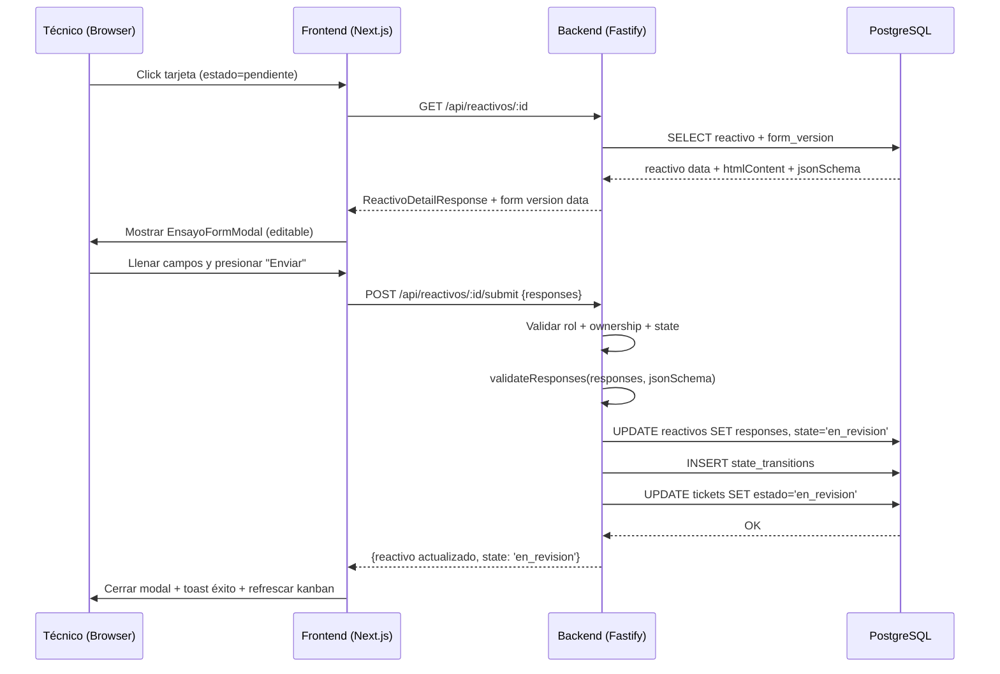
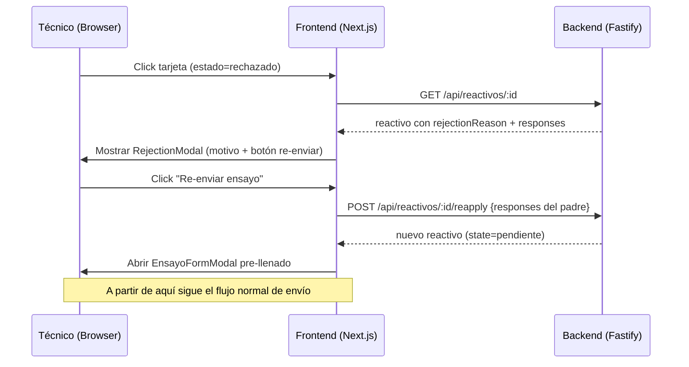

# Documento de Diseño Técnico — Ensayo Técnico

## Overview

El módulo "Ensayo Técnico" agrega la capacidad de que un técnico llene y envíe el formulario de ensayo directamente desde su tablero Kanban (`/my-kanban`). Dependiendo del estado del reactivo, la interacción al hacer clic en una tarjeta será:

- **Pendiente**: Abre un modal con el formulario HTML editable para llenado y envío.
- **Rechazado**: Muestra el motivo de rechazo y ofrece re-enviar (crea nuevo intento).
- **Otros estados**: Abre el visor de PDF existente (solo lectura).

El flujo principal es: abrir formulario → llenar campos → validar contra JSON Schema → enviar (POST /api/reactivos/:id/submit) → transicionar a "en_revision" → generar PDF → sincronizar ticket.

### Decisiones Técnicas Clave

| Componente | Decisión | Justificación |
|---|---|---|
| Modal de formulario | Nuevo componente `EnsayoFormModal` | Separa la lógica de edición del visor PDF existente |
| Renderizado HTML | `dangerouslySetInnerHTML` con HTML sanitizado del backend | El backend ya sanitiza con DOMPurify; re-sanitizar en frontend sería redundante |
| Recolección de datos | `FormData` API del navegador sobre el form DOM | El HTML del formulario ya tiene `name` attributes; no necesitamos recrear la estructura |
| Validación frontend | Llamar al endpoint y mostrar errores del backend | El JSON Schema validation ya existe en el backend; evita duplicar lógica |
| Nuevo endpoint | POST /api/reactivos/:id/submit | Separado de /reapply porque submit opera sobre el mismo reactivo en vez de crear uno nuevo |
| PDF generation | Reutilizar `PDFService.generate()` existente | Ya inyecta respuestas en HTML y genera PDF con Puppeteer |
| Re-envío | Reutilizar `ReactivoService.reapply()` existente | Ya implementa la lógica de crear hijo con parentReactivoId |

---

## Architecture

### Flujo de Interacción



### Flujo de Re-envío (Rechazado)



---

## Components and Interfaces

### Backend — Nuevo Endpoint

**POST /api/reactivos/:id/submit**

```typescript
// Request
interface SubmitReactivoBody {
  responses: Record<string, unknown>;
}

// Response 200
interface SubmitReactivoResponse {
  id: string;
  formId: string;
  formVersionId: string;
  tecnicoId: string;
  parentReactivoId: string | null;
  attemptNumber: number;
  state: 'en_revision';
  responses: Record<string, unknown>;
  rejectionReason: string | null;
  createdAt: string;
  updatedAt: string;
}

// Error responses
// 400 - Validation errors (field-specific)
// 403 - Not tecnico / not owner / wrong state
// 404 - Reactivo not found
// 500 - Internal error (generic message)
```

**Lógica del endpoint (en ReactivoService):**

```typescript
async submit(reactivoId: string, responses: Record<string, unknown>, actor: JWTPayload): Promise<ReactivoResponse> {
  // 1. Verificar que actor.role === 'tecnico'
  // 2. Obtener reactivo por id (404 si no existe)
  // 3. Verificar reactivo.tecnicoId === actor.sub (403)
  // 4. Verificar reactivo.state === 'pendiente' (403)
  // 5. Obtener form_version por reactivo.formVersionId
  // 6. validateResponses(responses, formVersion.jsonSchema)
  // 7. UPDATE reactivo: responses + state='en_revision'
  // 8. INSERT state_transitions (fromState='pendiente', toState='en_revision', actorId)
  // 9. Sync ticket state (reutilizar patrón de KanbanService.syncTicketState)
  // 10. Retornar reactivo actualizado
}
```

### Backend — Endpoint Auxiliar para Form Version

**GET /api/form-versions/:id**

Se necesita un endpoint para que el frontend obtenga el HTML content y JSON Schema de una versión específica. Revisando el código existente, el `GET /api/reactivos/:id` ya retorna `ReactivoDetailResponse` que incluye `formVersionId`. Necesitamos exponer el HTML content.

**Decisión:** Agregar un endpoint `GET /api/reactivos/:id/form` que retorne el HTML sanitizado y el JSON Schema para la versión asociada al reactivo.

```typescript
// Response 200
interface ReactivoFormResponse {
  htmlContent: string;
  sanitizedHtml: string;
  jsonSchema: unknown;
  fieldsMetadata: unknown[];
}
```

### Frontend — Nuevos Componentes

**1. EnsayoFormModal**

```typescript
interface EnsayoFormModalProps {
  reactivoId: string;
  htmlContent: string;       // sanitizedHtml del form_version
  initialResponses?: Record<string, unknown>;  // pre-fill para edición
  onClose: () => void;
  onSubmitSuccess: () => void;  // callback para refrescar kanban
}
```

Responsabilidades:
- Renderizar el HTML del formulario dentro de un `<form>` wrapper
- Inyectar valores iniciales en los campos usando DOM manipulation post-render
- Recolectar respuestas via `FormData` al submit
- Llamar POST /api/reactivos/:id/submit
- Mostrar errores de validación del backend
- Mostrar loading state durante el envío

**2. RejectionInfoModal**

```typescript
interface RejectionInfoModalProps {
  reactivoId: string;
  rejectionReason: string;
  formName: string;
  onClose: () => void;
  onReapply: () => void;  // trigger re-envío flow
}
```

Responsabilidades:
- Mostrar el motivo de rechazo
- Botón "Re-enviar ensayo" que llama POST /api/reactivos/:id/reapply
- Después de reapply exitoso, abrir EnsayoFormModal con respuestas del padre

**3. Modificación de MyKanbanPage**

La función `handleCardClick` se bifurca según el estado:
- `pendiente` → fetch form data → abrir `EnsayoFormModal`
- `rechazado` → fetch reactivo detail → abrir `RejectionInfoModal`
- otros → comportamiento actual (abrir PDF viewer)

---

## Data Models

### Tablas Afectadas (sin cambios de esquema)

El diseño no requiere migraciones de base de datos. Todas las tablas necesarias ya existen:

| Tabla | Uso en este módulo |
|---|---|
| `reactivos` | UPDATE responses + state en submit |
| `state_transitions` | INSERT nuevo registro en submit |
| `tickets` | UPDATE estado en sync |
| `form_versions` | SELECT htmlContent + jsonSchema |

### Flujo de Datos en Submit

```
Input: { responses: { campo1: "valor1", campo2: 42 } }
         ↓
Validación: validateResponses(input.responses, formVersion.jsonSchema)
         ↓
Persistencia: UPDATE reactivos SET responses = input.responses, state = 'en_revision'
         ↓
Auditoría: INSERT state_transitions (pendiente → en_revision)
         ↓
Sync: UPDATE tickets SET estado = 'en_revision' WHERE reactivo_id = :id
         ↓
Output: ReactivoResponse con state = 'en_revision'
```

---

## Correctness Properties

*A property is a characteristic or behavior that should hold true across all valid executions of a system — essentially, a formal statement about what the system should do. Properties serve as the bridge between human-readable specifications and machine-verifiable correctness guarantees.*

### Property 1: Schema validation correctness

*For any* JSON Schema and *for any* responses object, if the responses satisfy all required fields with correct types and constraints defined in the schema, then `validateResponses(responses, schema)` SHALL return `{ valid: true }`; conversely, if any required field is missing or has an incorrect type/constraint, it SHALL return `{ valid: false, errors: [...] }` where errors reference the specific failing fields.

**Validates: Requirements 3.1, 3.2**

### Property 2: Submit persists responses (round-trip)

*For any* reactivo in state "pendiente" and *for any* valid responses object (one that passes schema validation), after a successful POST /api/reactivos/:id/submit, querying the reactivo SHALL return a responses field identical to the submitted responses.

**Validates: Requirements 4.1**

### Property 3: Submit transitions state to en_revision

*For any* reactivo in state "pendiente" with a valid responses payload submitted by the assigned tecnico, after POST /api/reactivos/:id/submit, the reactivo state SHALL be "en_revision".

**Validates: Requirements 4.2**

### Property 4: Access control rejects unauthorized users

*For any* user who either (a) does not have role "tecnico", or (b) has role "tecnico" but their ID does not match the reactivo's tecnicoId, POST /api/reactivos/:id/submit SHALL return HTTP 403.

**Validates: Requirements 5.1, 5.2, 5.3**

### Property 5: State guard rejects non-pendiente reactivos

*For any* reactivo whose state is NOT "pendiente" (i.e., en_revision, validado, rechazado, or finalizado), POST /api/reactivos/:id/submit SHALL return an error rejecting the submission regardless of the payload or actor.

**Validates: Requirements 5.4**

### Property 6: Reapply preserves lineage and metadata

*For any* reactivo in state "rechazado" with attemptNumber N, after a successful reapply, the newly created reactivo SHALL have: parentReactivoId = original.id, attemptNumber = N + 1, state = "pendiente", and formId, formVersionId, tecnicoId, clienteNombre matching the original.

**Validates: Requirements 7.1, 7.2**

### Property 7: Submit creates audit trail

*For any* successful submit operation, a record SHALL exist in state_transitions with fromState = "pendiente", toState = "en_revision", actorId = the submitting tecnico's ID, and reactivoId = the submitted reactivo's ID.

**Validates: Requirements 8.5**

---

## Error Handling

### Backend Error Responses

| Escenario | HTTP Code | Error Code | Mensaje |
|---|---|---|---|
| Reactivo no encontrado | 404 | `REACTIVO_NOT_FOUND` | "Reactivo no encontrado" |
| No es técnico | 403 | `UNAUTHORIZED_ROLE` | "Solo el técnico puede enviar ensayos" |
| No es el técnico asignado | 403 | `NOT_OWNER` | "Solo el técnico asignado puede enviar este ensayo" |
| Estado no es pendiente | 403 | `INVALID_STATE_FOR_SUBMIT` | "El ensayo no es editable en su estado actual" |
| Respuestas inválidas | 400 | `INVALID_RESPONSES` | "Respuestas inválidas: {field errors}" |
| Error interno | 500 | `INTERNAL_ERROR` | "Error interno del servidor" |

### Frontend Error Handling

- **Errores de validación (400)**: Parsear el array de errores y mostrar mensajes junto a los campos correspondientes.
- **Errores de acceso (403)**: Mostrar toast con el mensaje del backend y cerrar el modal.
- **Reactivo no encontrado (404)**: Mostrar toast de error y refrescar el kanban (el reactivo pudo haber sido eliminado).
- **Errores de red**: Mostrar toast genérico "Error de conexión" y mantener el modal abierto para retry.

### Validación de Entradas

- El body de submit DEBE ser un objeto con key `responses` de tipo `Record<string, unknown>`.
- El parámetro `:id` DEBE ser un UUID v4 válido (ya validado por `reactivoIdParamSchema` existente).
- Respuestas vacías `{}` se validan contra el schema — si el schema tiene campos required, se rechaza.

---

## Testing Strategy

### Property-Based Tests (Vitest + fast-check)

Se usará `fast-check` como librería de property-based testing integrada con Vitest (ya configurado en el proyecto).

**Configuración:** Mínimo 100 iteraciones por property test.

| Property | Qué se genera | Qué se verifica |
|---|---|---|
| 1: Schema validation | JSON Schemas aleatorios + responses válidos/inválidos | validateResponses acepta/rechaza correctamente |
| 2: Submit round-trip | Responses válidos aleatorios | Persistencia fiel de responses |
| 3: State transition | Reactivos en estado pendiente | State cambia a en_revision |
| 4: Access control | Usuarios con roles/IDs variados | 403 para no-autorizados |
| 5: State guard | Reactivos en estados no-pendiente | Rechazo consistente |
| 6: Reapply lineage | Reactivos rechazados con attemptNumber variado | Metadata y links correctos |
| 7: Audit trail | Submits exitosos | Registro en state_transitions |

### Unit Tests (Example-Based)

- Endpoint contract: verificar estructura de response para submit exitoso.
- Edge cases: UUID inexistente → 404, body vacío → 400.
- Frontend: renderizado del modal con HTML conocido.
- Frontend: flujo de re-envío (click rechazado → modal rechazo → reapply → modal editable).

### Integration Tests

- Flujo completo: crear ticket → crear reactivo → submit → verificar PDF generado.
- Sync de ticket: submit reactivo → verificar ticket.estado actualizado.
- Re-envío completo: rechazar → reapply → submit nuevo intento.

### Tag Format

Cada property test llevará el comentario:
```
// Feature: ensayo-tecnico, Property {N}: {title}
```
