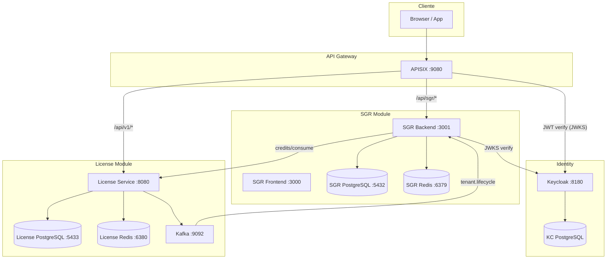
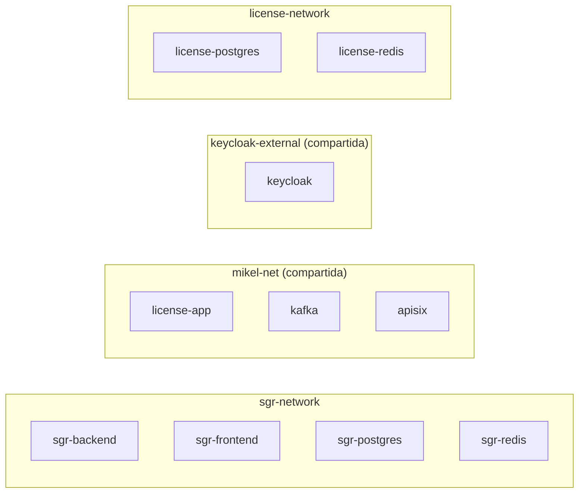
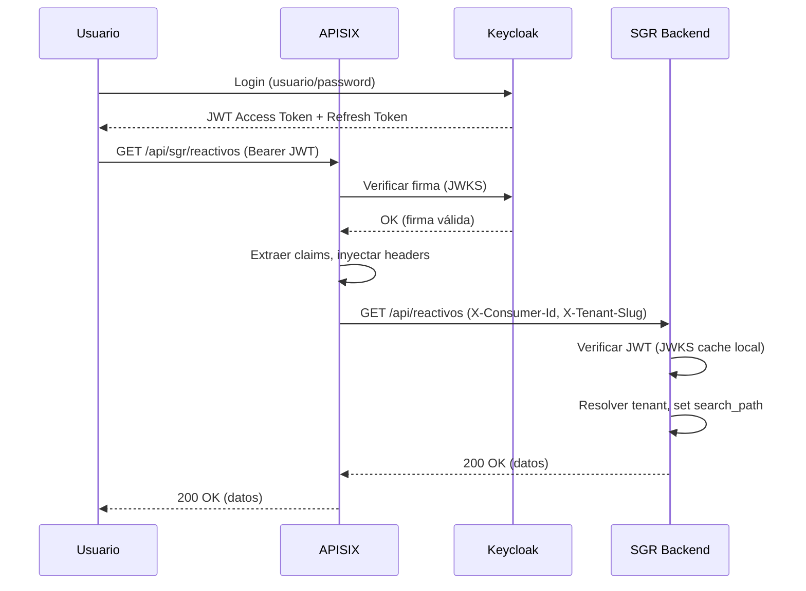

# Diseño Técnico — Integración Plataforma

## Overview

Este documento define el diseño técnico para integrar el SGR (Sistema de Gestión de Ensayos) con la plataforma SaaS compuesta por License Service, Keycloak y APISIX. La integración convierte al SGR de una aplicación standalone en un módulo de una plataforma multi-servicio con autenticación centralizada, enrutamiento por gateway, ciclo de vida de tenants coordinado y consumo de créditos inter-servicio.

### Principio de Diseño: Modo Dual (Standalone vs Integrado)

El SGR operará en dos modos controlados por la variable de entorno `STANDALONE_AUTH`:

- **Standalone (`STANDALONE_AUTH=true`, default)**: Comportamiento actual. JWT auto-emitido, sin Kafka, sin consumo de créditos. Un `git clone` fresco funciona sin configuración.
- **Integrado (`STANDALONE_AUTH=false`)**: JWT validado contra Keycloak JWKS, consumidor Kafka activo, consumo de créditos habilitado. Requiere infraestructura de plataforma.

### Decisiones Técnicas Clave

| Decisión | Elección | Justificación |
|----------|----------|---------------|
| Verificación JWT Keycloak | `jose` (ya existente) con `createRemoteJWKSet` | Reutiliza la dependencia actual, soporte nativo JWKS remoto |
| Consumer Kafka | `kafkajs` | Librería estándar Node.js, buen soporte TypeScript, graceful shutdown |
| Circuit Breaker | `opossum` | Librería madura para Node.js, configurable, métricas built-in |
| Docker overlay | `docker-compose.override.yml` | No modifica el compose base, activación explícita |
| Roles Keycloak → SGR | Mapeo directo (sin transformación) | Keycloak es fuente única de verdad, roles idénticos |

---

## Architecture

### Diagrama de Alto Nivel



### Diagrama de Redes Docker



### Flujo de Autenticación (Modo Integrado)



---

## Components and Interfaces

### 1. Auth Module Refactored (`modules/auth/`)

#### `AuthStrategyFactory` — Selección de estrategia de autenticación

```typescript
// src/modules/auth/auth-strategy.factory.ts
interface AuthStrategy {
  verifyToken(token: string): Promise<JWTPayload>;
  isLoginEnabled(): boolean;
}

// Devuelve StandaloneAuthStrategy o KeycloakAuthStrategy
// según STANDALONE_AUTH env var
function createAuthStrategy(config: AppConfig): AuthStrategy;
```

#### `KeycloakAuthStrategy` — Verificación JWT contra JWKS remoto

```typescript
// src/modules/auth/keycloak-auth.strategy.ts
class KeycloakAuthStrategy implements AuthStrategy {
  private jwks: ReturnType<typeof createRemoteJWKSet>;
  
  constructor(jwksUrl: string, expectedIssuer: string);
  
  // Verifica firma RS256 contra JWKS cacheado (TTL 300s)
  async verifyToken(token: string): Promise<JWTPayload>;
  
  // En modo integrado, login no es posible en SGR
  isLoginEnabled(): boolean; // return false
}
```

#### `StandaloneAuthStrategy` — Auth actual (sin cambios)

```typescript
// src/modules/auth/standalone-auth.strategy.ts
class StandaloneAuthStrategy implements AuthStrategy {
  // Comportamiento actual de AuthService.verifyToken
  async verifyToken(token: string): Promise<JWTPayload>;
  isLoginEnabled(): boolean; // return true
}
```

#### Middleware Actualizado

```typescript
// src/modules/auth/auth.middleware.ts (modificado)
// - Recibe AuthStrategy en vez de AuthService directamente
// - Si token tiene issuer "sgr-api" y estamos en modo integrado → 401
// - Si token tiene issuer keycloak y estamos en standalone → 401
```

### 2. Kafka Consumer Module (`modules/kafka/`)

```typescript
// src/modules/kafka/kafka.consumer.ts
class TenantLifecycleConsumer {
  private kafka: Kafka;
  private consumer: Consumer;
  
  constructor(config: KafkaConfig);
  
  async start(): Promise<void>;      // Connect + subscribe + run
  async shutdown(): Promise<void>;   // Graceful disconnect
  
  // Handlers por tipo de evento
  private handleTenantCreated(payload: TenantCreatedEvent): Promise<void>;
  private handleTenantSuspended(payload: TenantSuspendedEvent): Promise<void>;
  private handleTenantReactivated(payload: TenantReactivatedEvent): Promise<void>;
}
```

#### Eventos Kafka

```typescript
// src/modules/kafka/kafka.events.ts
interface TenantCreatedEvent {
  type: 'tenant.created';
  tenant_id: string;
  slug: string;
  nombre: string;
  admin_email: string;
  timestamp: string;
}

interface TenantSuspendedEvent {
  type: 'tenant.suspended';
  tenant_id: string;
  slug: string;
  timestamp: string;
}

interface TenantReactivatedEvent {
  type: 'tenant.reactivated';
  tenant_id: string;
  slug: string;
  timestamp: string;
}

type TenantLifecycleEvent = 
  | TenantCreatedEvent 
  | TenantSuspendedEvent 
  | TenantReactivatedEvent;
```

### 3. Credit Service Client (`modules/credits/`)

```typescript
// src/modules/credits/credit.client.ts
class CreditClient {
  private circuitBreaker: CircuitBreaker;
  private httpClient: typeof fetch;
  
  constructor(config: CreditClientConfig);
  
  async consume(tenantId: string, operation: CreditOperation): Promise<CreditResult>;
  async compensate(tenantId: string, operationId: string): Promise<void>;
  
  getCircuitState(): 'closed' | 'open' | 'half-open';
}

interface CreditClientConfig {
  baseUrl: string;          // http://license-app:8080
  timeoutMs: number;        // 5000
  circuitBreaker: {
    failureThreshold: number; // 3
    resetTimeout: number;     // 60000 ms
  };
}

interface CreditOperation {
  operationType: 'pdf_generation';
  metadata: {
    reactivoId: string;
    formType: string;
  };
}

type CreditResult = 
  | { status: 'approved'; remainingCredits: number }
  | { status: 'insufficient'; message: string }
  | { status: 'deferred'; debtId: string }; // circuit breaker abierto
```

### 4. Tenant Provisioning Service (`modules/tenant/`)

```typescript
// src/modules/tenant/tenant-provisioning.service.ts
class TenantProvisioningService {
  constructor(private db: Database, private sql: Sql);
  
  // Idempotente: si el schema ya existe, no-op
  async provisionTenant(event: TenantCreatedEvent): Promise<void>;
  
  async suspendTenant(slug: string): Promise<void>;
  async reactivateTenant(slug: string): Promise<void>;
  
  private async createSchema(slug: string): Promise<void>;
  private async applySchemaTemplate(schemaName: string): Promise<void>;
  private async createAdminUser(schemaName: string, email: string): Promise<void>;
  private async invalidateTenantCache(slug: string): Promise<void>;
}
```

### 5. Configuración Extendida (`lib/config.ts`)

```typescript
// src/lib/config.ts (extendido)
interface AppConfig {
  // ... campos existentes ...
  
  standaloneAuth: boolean;  // STANDALONE_AUTH env var
  
  keycloak?: {
    jwksUrl: string;        // KEYCLOAK_JWKS_URL
    issuer: string;         // KEYCLOAK_ISSUER
    jwksCacheTtl: number;   // 300 seconds
  };
  
  kafka?: {
    brokers: string[];      // KAFKA_BROKERS (comma-separated)
    groupId: string;        // sgr-tenant-lifecycle
    topic: string;          // tenant.lifecycle
  };
  
  licenseService?: {
    baseUrl: string;        // LICENSE_SERVICE_URL
    timeoutMs: number;      // 5000
    circuitBreaker: {
      failureThreshold: number;
      resetTimeoutMs: number;
    };
  };
}
```

### 6. APISIX Route Configuration

```yaml
# Nuevo upstream en apisix.yaml
- id: "upstream-sgr"
  name: sgr-backend
  type: roundrobin
  scheme: http
  nodes:
    "sgr-backend:3001": 1
  checks:
    active:
      type: http
      http_path: /api/health
      healthy:
        interval: 10
        successes: 2
      unhealthy:
        interval: 5
        http_failures: 3
  timeout:
    connect: 3
    send: 5
    read: 30

# Nueva ruta
- id: "route-sgr"
  name: "SGR API"
  uri: /api/sgr/*
  methods: [GET, POST, PUT, PATCH, DELETE, OPTIONS]
  upstream_id: "upstream-sgr"
  priority: 10
  plugins:
    openid-connect:
      client_id: apisix-gateway
      client_secret: apisix-gateway-secret-dev
      discovery: http://keycloak:8080/realms/mikel-crm/.well-known/openid-configuration
      bearer_only: true
      use_jwks: true
      token_signing_alg_values_expected: RS256
      ssl_verify: false
      cache_ttl: 300
    proxy-rewrite:
      regex_uri:
        - "^/api/sgr/(.*)"
        - "/api/$1"
      headers:
        remove:
          - Authorization
    serverless-pre-function:
      phase: rewrite
      functions:
        - |
          return function(conf, ctx)
            -- Extraer claims del JWT y setear headers
            local ngx = ngx
            local cjson = require("cjson.safe")
            local auth = ngx.req.get_headers()["Authorization"]
            if not auth then return nil end
            local token = auth:sub(8)
            local dot1 = token:find("%.")
            if not dot1 then return nil end
            local dot2 = token:find("%.", dot1 + 1)
            if not dot2 then return nil end
            local b64 = token:sub(dot1 + 1, dot2 - 1)
            b64 = b64:gsub("-", "+"):gsub("_", "/")
            local rem = #b64 % 4
            if rem == 2 then b64 = b64 .. "=="
            elseif rem == 3 then b64 = b64 .. "=" end
            local json = ngx.decode_base64(b64)
            if not json then return nil end
            local claims = cjson.decode(json)
            if not claims then return nil end
            if claims.sub then ngx.req.set_header("X-Consumer-Id", claims.sub) end
            if claims.tenant_id then ngx.req.set_header("X-Tenant-Slug", claims.tenant_id) end
            if claims.plan_type then ngx.req.set_header("X-Plan-Type", claims.plan_type) end
            -- Extraer slug del Host header
            local host = ngx.var.host
            if host then
              local slug = host:match("^([^%.]+)%.")
              if slug and slug ~= "localhost" and slug ~= "www" then
                ngx.req.set_header("X-Tenant-Slug", slug)
              end
            end
            return nil
          end
    cors:
      allow_origins: "http://localhost:3000,http://localhost:3001"
      allow_methods: "GET,POST,PUT,PATCH,DELETE,OPTIONS"
      allow_headers: "Authorization,Content-Type,X-Request-ID,Accept,X-Tenant-Slug"
      expose_headers: "X-Request-ID"
      max_age: 3600
      allow_credential: true
```

### 7. Docker Compose Override

```yaml
# docker-compose.override.yml (para modo integrado)
services:
  backend:
    environment:
      STANDALONE_AUTH: "false"
      KEYCLOAK_JWKS_URL: http://keycloak:8080/realms/mikel-crm/protocol/openid-connect/certs
      KEYCLOAK_ISSUER: http://keycloak:8080/realms/mikel-crm
      KAFKA_BROKERS: kafka:9092
      LICENSE_SERVICE_URL: http://license-app:8080
    networks:
      - sgr-network
      - mikel-net
      - keycloak-external

  postgres:
    networks:
      - sgr-network
      - mikel-net

networks:
  sgr-network:
    driver: bridge
  mikel-net:
    name: mikel-net
    external: true
  keycloak-external:
    name: keycloak-external
    external: true
```

---

## Data Models

### Claims JWT de Keycloak (Payload esperado)

```typescript
interface KeycloakJWTPayload {
  // Standard claims
  sub: string;              // Keycloak user ID (UUID)
  iss: string;              // http://keycloak:8080/realms/mikel-crm
  aud: string | string[];   // Client ID(s)
  exp: number;              // Expiration
  iat: number;              // Issued at
  jti: string;              // Token ID

  // Custom claims (configurados en Keycloak mapper)
  tenant_id: string;        // UUID del tenant en license-service
  roles: string[];          // ["admin"] | ["tecnico"] | etc.
  email: string;
  preferred_username: string;
  
  // Opcionales
  plan_type?: string;       // PLAN_BASIC | PLAN_PRO | PLAN_ENTERPRISE
  license_id?: string;      // ID de licencia en license-service
}
```

### JWTPayload Interno del SGR (Normalizado)

```typescript
// src/modules/auth/auth.types.ts (actualizado)
interface JWTPayload {
  sub: string;              // User ID
  role: string;             // Rol único (primer elemento de roles[])
  tenantId: string;         // UUID tenant
  tenantSlug: string;       // Slug resuelto (del header o lookup)
  email: string;
  name: string;             // preferred_username
  iat: number;
  exp: number;
  jti: string;
}
```

### Eventos Kafka (Schema)

```json
// Topic: tenant.lifecycle
// Key: tenant_id (para garantizar orden por tenant)
{
  "type": "tenant.created",
  "tenant_id": "uuid",
  "slug": "empresa-abc",
  "nombre": "Empresa ABC S.A. de C.V.",
  "admin_email": "admin@empresa-abc.com",
  "timestamp": "2024-01-15T10:30:00Z"
}

{
  "type": "tenant.suspended",
  "tenant_id": "uuid",
  "slug": "empresa-abc",
  "timestamp": "2024-02-01T08:00:00Z"
}

{
  "type": "tenant.reactivated",
  "tenant_id": "uuid",
  "slug": "empresa-abc",
  "timestamp": "2024-02-05T09:00:00Z"
}
```

### Tabla `platform.tenants` (existente, sin cambios)

```sql
CREATE TABLE platform.tenants (
  id UUID PRIMARY KEY DEFAULT gen_random_uuid(),
  slug VARCHAR(63) UNIQUE NOT NULL,
  name VARCHAR(255) NOT NULL,
  status VARCHAR(20) NOT NULL DEFAULT 'active', -- active, suspended, pending_deletion
  created_at TIMESTAMPTZ DEFAULT NOW(),
  updated_at TIMESTAMPTZ DEFAULT NOW()
);
```

### Tabla de Deudas Pendientes (nueva)

```sql
CREATE TABLE platform.credit_debts (
  id UUID PRIMARY KEY DEFAULT gen_random_uuid(),
  tenant_id UUID NOT NULL REFERENCES platform.tenants(id),
  operation_type VARCHAR(50) NOT NULL,          -- 'pdf_generation'
  metadata JSONB NOT NULL,                       -- {reactivoId, formType}
  status VARCHAR(20) NOT NULL DEFAULT 'pending', -- pending, reconciled, failed
  created_at TIMESTAMPTZ DEFAULT NOW(),
  reconciled_at TIMESTAMPTZ
);
```

---


## Correctness Properties

*A property is a characteristic or behavior that should hold true across all valid executions of a system — essentially, a formal statement about what the system should do. Properties serve as the bridge between human-readable specifications and machine-verifiable correctness guarantees.*

### Property 1: Token Verification Correctness

*For any* JWT token, the `KeycloakAuthStrategy.verifyToken` function SHALL return a valid payload if and only if the token was signed with a key present in the JWKS keyset and is not expired. Tokens with invalid signatures, expired timestamps, or unknown keys SHALL produce an AUTH_INVALID_TOKEN error.

**Validates: Requirements 1.1, 1.4**

### Property 2: Claim Extraction Completeness

*For any* valid JWT de Keycloak con claims arbitrarios (sub, tenant_id, roles, email, preferred_username), la función de extracción SHALL mapear todos los claims a la estructura interna `JWTPayload` sin transformación de roles — el valor de `roles[0]` del JWT debe aparecer idéntico en `payload.role`.

**Validates: Requirements 1.2, 1.3**

### Property 3: Mode-Based Token Acceptance

*For any* JWT token con issuer I y modo de operación M, el Middleware_Auth SHALL aceptar el token si y solo si: (M=standalone AND I="sgr-api") OR (M=integrado AND I=keycloak_issuer). Cualquier otra combinación de issuer/modo SHALL producir 401.

**Validates: Requirements 1.6, 1.7, 11.1**

### Property 4: URL Path Rewrite Preservation

*For any* path string P, la regla proxy-rewrite de APISIX SHALL transformar `/api/sgr/{P}` en `/api/{P}` preservando exactamente el contenido de P incluyendo sub-paths, query strings y caracteres especiales.

**Validates: Requirements 3.5**

### Property 5: Subdomain Slug Extraction

*For any* Host header del formato `{slug}.{dominio}` donde slug es un string alfanumérico con guiones, la función de extracción de subdominio SHALL retornar exactamente el slug. Para hosts sin subdominio (localhost, IPs, dominios bare), SHALL retornar null.

**Validates: Requirements 4.1**

### Property 6: Tenant Resolution from Header

*For any* petición con header X-Tenant-Slug conteniendo un slug que existe en `platform.tenants` con status `active`, el tenant middleware SHALL configurar el search_path a `sgr_{slug}, public` y poblar `request.tenantContext` correctamente.

**Validates: Requirements 4.2**

### Property 7: Tenant Resolution Fallback from JWT

*For any* petición sin header X-Tenant-Slug pero con un JWT conteniendo tenant_id válido, el sistema SHALL buscar el slug correspondiente en `platform.tenants` y resolver el schema correctamente, produciendo el mismo resultado que si el header estuviera presente.

**Validates: Requirements 4.3**

### Property 8: Tenant Error Responses Match State

*For any* slug S, si S no existe en `platform.tenants` THEN la respuesta SHALL ser 404 con código TENANT_NOT_FOUND. Si S existe pero su status no es `active` THEN la respuesta SHALL ser 403 con código TENANT_SUSPENDED. En ambos casos, no se debe ejecutar lógica de negocio.

**Validates: Requirements 4.4, 4.5**

### Property 9: Tenant Provisioning Idempotency

*For any* evento `tenant.created` con slug S, procesarlo N veces (N ≥ 1) SHALL producir exactamente un schema `sgr_{S}`, un registro en `platform.tenants` y un usuario admin. La segunda y subsiguientes ejecuciones SHALL ser no-ops sin error.

**Validates: Requirements 5.6**

### Property 10: Tenant Provisioning Completeness

*For any* evento `tenant.created` válido con slug S, nombre N y admin_email E, al completar el procesamiento SHALL existir: (1) schema PostgreSQL `sgr_{S}` con todas las tablas del template, (2) registro en `platform.tenants` con slug=S, nombre=N, status=active, y (3) usuario en `sgr_{S}.users` con email=E y role=admin.

**Validates: Requirements 5.2, 5.3, 5.4**

### Property 11: Tenant Lifecycle State Machine

*For any* tenant con status inicial, aplicar una secuencia de eventos de ciclo de vida SHALL producir transiciones de estado correctas: `tenant.suspended` cambia status a `suspended` e invalida caché Redis; `tenant.reactivated` cambia status a `active`. Las transiciones SHALL ser idempotentes (suspender un tenant ya suspendido es no-op).

**Validates: Requirements 6.2, 6.3, 6.5**

### Property 12: Credit Consumption Ordering

*For any* solicitud de generación de PDF en modo integrado con circuit breaker cerrado, el SGR SHALL invocar `credits/consume` ANTES de iniciar la generación del PDF. Si la respuesta es 200, el PDF se genera. Si la respuesta es 402, el PDF NO se genera y se retorna 402 al usuario. El orden consume→genera SHALL mantenerse siempre.

**Validates: Requirements 7.1, 7.2, 7.3**

### Property 13: Circuit Breaker Deferred Mode

*For any* solicitud de PDF cuando el Circuit_Breaker está abierto (≥3 fallos consecutivos en 60s) O cuando License_Service no responde en 5s, el SGR SHALL permitir la generación del PDF y registrar una deuda en `platform.credit_debts`. Si la generación falla después de consumir crédito, SHALL invocar `credits/compensate`.

**Validates: Requirements 7.4, 7.5, 7.6**

### Property 14: Kafka Retry Backoff Calculation

*For any* intento de reconexión N (donde 1 ≤ N ≤ 5), el delay de backoff exponencial SHALL ser exactamente `2^(N-1)` segundos (1s, 2s, 4s, 8s, 16s). Después del intento 5, SHALL cesar los reintentos.

**Validates: Requirements 9.3**

### Property 15: Integrated Mode Configuration Validation

*For any* combinación de variables de entorno donde STANDALONE_AUTH=false, el SGR SHALL fallar al iniciar si alguna de las variables KEYCLOAK_JWKS_URL, KAFKA_BROKERS o LICENSE_SERVICE_URL no está definida. El error SHALL indicar exactamente cuál variable falta.

**Validates: Requirements 11.5**

---

## Error Handling

### Estrategia General

| Capa | Error | Acción | Código HTTP |
|------|-------|--------|-------------|
| Auth Middleware | Token inválido/expirado | Rechazar con detalle | 401 |
| Auth Middleware | Token issuer incorrecto para el modo | Rechazar | 401 |
| Auth Middleware | JWKS endpoint inalcanzable | Usar cache; si no hay cache → 503 | 503 |
| Tenant Middleware | Slug no encontrado | Rechazar | 404 |
| Tenant Middleware | Tenant suspendido | Rechazar | 403 |
| Credit Client | Saldo insuficiente | Cancelar operación | 402 |
| Credit Client | Timeout (>5s) | Circuit breaker, generar con deuda | 200 (con warning header) |
| Credit Client | Circuit breaker abierto | Generar con deuda | 200 (con warning header) |
| Kafka Consumer | Error de procesamiento | No commit offset, log error | N/A (reintento) |
| Kafka Consumer | Conexión perdida | Reconexión con backoff | N/A |
| Startup | Variable requerida faltante | Fail fast con mensaje claro | N/A (process.exit(1)) |

### Errores Específicos

```typescript
// Nuevos códigos de error para integración
enum IntegrationErrorCode {
  AUTH_INVALID_TOKEN = 'AUTH_INVALID_TOKEN',
  AUTH_ISSUER_MISMATCH = 'AUTH_ISSUER_MISMATCH',
  AUTH_ENDPOINT_DISABLED = 'AUTH_ENDPOINT_DISABLED',
  TENANT_NOT_FOUND = 'TENANT_NOT_FOUND',
  TENANT_SUSPENDED = 'TENANT_SUSPENDED',
  CREDITS_INSUFFICIENT = 'CREDITS_INSUFFICIENT',
  CREDITS_SERVICE_UNAVAILABLE = 'CREDITS_SERVICE_UNAVAILABLE',
  CONFIG_MISSING_REQUIRED = 'CONFIG_MISSING_REQUIRED',
}
```

### Circuit Breaker — Configuración

```typescript
const circuitBreakerOptions = {
  timeout: 5000,              // 5 segundos timeout por request
  errorThresholdPercentage: 50,
  resetTimeout: 60000,        // 60 segundos antes de half-open
  volumeThreshold: 3,         // Mínimo 3 requests antes de evaluar
};
```

### Compensación de Créditos

Cuando el PDF falla después de consumir un crédito:
1. Invocar `POST /api/v1/tenants/{id}/credits/compensate` con el operation_id
2. Si la compensación falla → registrar en `credit_debts` con status `pending` para reconciliación manual
3. Log de auditoría con todos los detalles

---

## Testing Strategy

### Enfoque Dual: Unit Tests + Property-Based Tests

**Unit Tests (vitest)**:
- Casos específicos de configuración (modo standalone vs integrado)
- Integración entre middleware auth → tenant → routes
- Edge cases: token vacío, header malformado, slug con caracteres especiales
- Mock de servicios externos (Keycloak JWKS, License Service, Kafka)

**Property-Based Tests (fast-check + vitest)**:
- Librería: `fast-check` (ya presente en devDependencies)
- Mínimo 100 iteraciones por propiedad
- Cada test referencia su propiedad del diseño
- Tag format: `Feature: integracion-plataforma, Property {N}: {título}`

### Estructura de Tests

```
packages/backend/src/
├── modules/auth/__tests__/
│   ├── keycloak-auth.strategy.spec.ts    # Properties 1, 2, 3
│   └── auth.middleware.integration.spec.ts
├── modules/tenant/__tests__/
│   ├── tenant-resolution.spec.ts          # Properties 5, 6, 7, 8
│   └── tenant-provisioning.spec.ts        # Properties 9, 10, 11
├── modules/credits/__tests__/
│   ├── credit-client.spec.ts              # Properties 12, 13
│   └── circuit-breaker.spec.ts
├── modules/kafka/__tests__/
│   ├── kafka-consumer.spec.ts             # Property 14
│   └── event-processing.spec.ts
└── lib/__tests__/
    └── config.validation.spec.ts          # Property 15
```

### Configuración de Property Tests

```typescript
// vitest.config.ts — no requiere cambios, fast-check ya está en deps
// Cada test de propiedad usa:
import fc from 'fast-check';

// Ejemplo de estructura:
describe('Feature: integracion-plataforma, Property 1: Token Verification Correctness', () => {
  it('accepts tokens signed with valid JWKS key', () => {
    fc.assert(
      fc.property(
        arbitraryValidJWT(),
        (token) => {
          const result = strategy.verifyToken(token);
          expect(result).resolves.toMatchObject({ sub: expect.any(String) });
        }
      ),
      { numRuns: 100 }
    );
  });
});
```

### Integration Tests

- Docker-based con `testcontainers` o contra servicios levantados
- APISIX route validation (Properties 4: URL rewrite)
- Kafka end-to-end (producir evento → verificar schema creado)
- Network connectivity (SGR → License Service via mikel-net)

### Cobertura Mínima

| Módulo | Unit | Property | Integration |
|--------|------|----------|-------------|
| Auth Strategy | ✅ | ✅ (P1-P3) | ✅ (JWKS real) |
| Tenant Resolution | ✅ | ✅ (P5-P8) | — |
| Tenant Provisioning | ✅ | ✅ (P9-P11) | ✅ (Kafka + DB) |
| Credit Client | ✅ | ✅ (P12-P13) | ✅ (License real) |
| Kafka Consumer | ✅ | ✅ (P14) | ✅ (Kafka real) |
| Config Validation | ✅ | ✅ (P15) | — |
| APISIX Routes | — | — | ✅ (APISIX real) |
