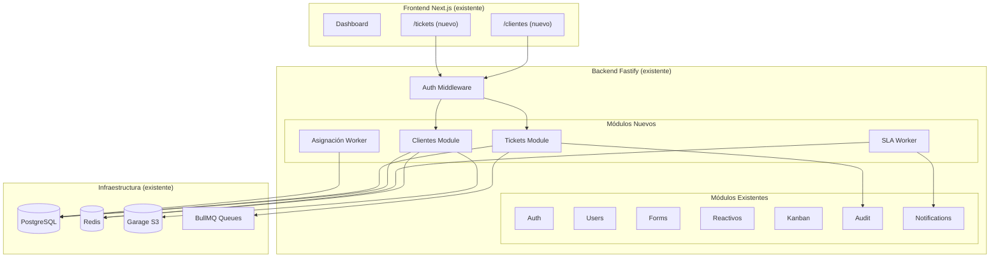
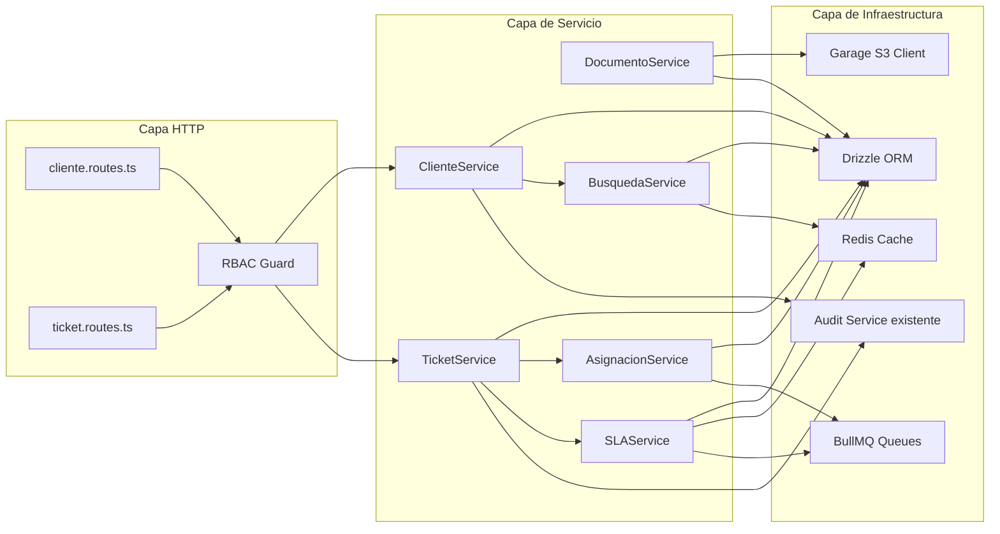
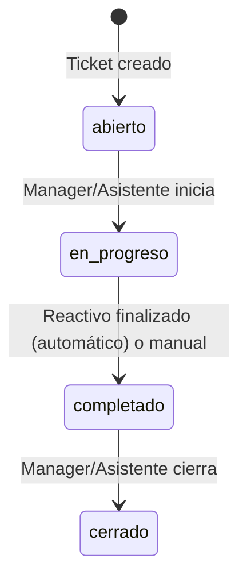

# Documento de Diseño Técnico — Módulo de Clientes

## Visión General

El Módulo de Clientes extiende el SGR existente con capacidades de gestión de clientes y tickets de solicitud de ensayo. Se integra como nuevos módulos dentro del backend Fastify y nuevas páginas en el frontend Next.js, reutilizando la infraestructura existente (PostgreSQL, Redis, Garage S3, BullMQ).

### Decisiones Técnicas Clave

| Componente | Tecnología | Justificación |
|---|---|---|
| Backend | Fastify + TypeScript (módulos nuevos) | Consistencia con SGR existente |
| Frontend | Next.js + Tailwind CSS (páginas nuevas) | Consistencia con SGR existente |
| Base de datos | PostgreSQL con VARCHAR (sin enums) | Flexibilidad para nuevos estados sin migraciones |
| Almacenamiento | Garage S3 | Infraestructura existente del SGR |
| Cache | Redis | Resultados de búsqueda, verificaciones SLA |
| Colas | BullMQ | Alertas SLA, ejecución de reglas de asignación |
| ORM | Drizzle ORM | Consistencia con esquemas existentes |
| Validación | Zod | Consistencia con validación existente |
| Búsqueda | PostgreSQL tsvector/tsquery | Sin dependencias externas, suficiente para el volumen esperado |

### Alcance

- Nuevo rol `asistente` en el sistema de roles existente
- CRUD de clientes con contactos y documentos
- Tickets (solicitudes de ensayo) vinculados a clientes y formularios existentes
- Reglas de asignación automática de técnicos
- Configuración de SLA con alertas temporales
- Búsqueda full-text y filtros combinados

---

## Arquitectura

### Diagrama de Integración con SGR Existente



### Diagrama de Módulos del Backend (Clientes)



### Máquina de Estados del Ticket



**Transiciones válidas (estrictamente unidireccionales):**
- `abierto` → `en_progreso`
- `en_progreso` → `completado`
- `completado` → `cerrado`

No se permiten retrocesos ni saltos de estado.

---

## Componentes e Interfaces

### 1. Módulo de Clientes (ClientesModule)

**Responsabilidad:** CRUD de clientes, gestión de etiquetas, documentos adjuntos.

```typescript
// packages/backend/src/modules/clientes/cliente.service.ts

interface ClienteService {
  create(data: CreateClienteDTO, actor: Actor): Promise<Cliente>;
  update(id: string, data: UpdateClienteDTO, actor: Actor): Promise<Cliente>;
  getById(id: string): Promise<ClienteDetalle | null>;
  list(filters: ClienteFilters, pagination: Pagination): Promise<PaginatedResult<Cliente>>;
  search(query: string, filters: ClienteFilters, pagination: Pagination): Promise<PaginatedResult<Cliente>>;
  addTag(clienteId: string, tag: string, actor: Actor): Promise<string[]>;
  removeTag(clienteId: string, tag: string, actor: Actor): Promise<string[]>;
  deactivate(id: string, actor: Actor): Promise<void>;
}

interface CreateClienteDTO {
  nombre: string;       // Obligatorio
  empresa: string;      // Obligatorio
  email: string;        // Obligatorio, formato RFC 5322
  telefono: string;     // Obligatorio, 7-15 dígitos
  direccion?: string;   // Opcional
  industria?: string;   // Opcional
  etiquetas?: string[]; // Opcional
}

interface UpdateClienteDTO {
  nombre?: string;
  empresa?: string;
  email?: string;
  telefono?: string;
  direccion?: string | null;
  industria?: string | null;
  etiquetas?: string[];
}

interface ClienteFilters {
  industria?: string;
  etiquetas?: string[];        // Intersección (AND)
  asignadoA?: string;          // UUID del técnico/vendedor
  fechaDesde?: Date;
  fechaHasta?: Date;
  activo?: boolean;
}

interface ClienteDetalle extends Cliente {
  contactos: ClienteContacto[];
  documentos: ClienteDocumento[];
  tickets: TicketResumen[];
}
```

### 2. Módulo de Documentos (DocumentoService)

**Responsabilidad:** Upload, listado y descarga de documentos de clientes via Garage S3.

```typescript
// packages/backend/src/modules/clientes/documento.service.ts

interface DocumentoService {
  upload(clienteId: string, file: UploadedFile, actor: Actor): Promise<ClienteDocumento>;
  list(clienteId: string): Promise<ClienteDocumento[]>;
  getDownloadUrl(documentoId: string): Promise<string>;
  delete(documentoId: string, actor: Actor): Promise<void>;
}

interface UploadedFile {
  originalName: string;
  buffer: Buffer;
  mimeType: string;
  size: number;
}

// Constantes de validación
const MAX_FILE_SIZE_BYTES = 10 * 1024 * 1024; // 10 MB
const ALLOWED_MIME_TYPES = [
  'application/pdf',
  'image/jpeg',
  'image/png',
  'application/msword',
  'application/vnd.openxmlformats-officedocument.wordprocessingml.document',
] as const;
```

### 3. Módulo de Tickets (TicketsModule)

**Responsabilidad:** Gestión del ciclo de vida de tickets (solicitudes de ensayo).

```typescript
// packages/backend/src/modules/tickets/ticket.service.ts

interface TicketService {
  create(data: CreateTicketDTO, actor: Actor): Promise<Ticket>;
  getById(id: string): Promise<TicketDetalle | null>;
  list(filters: TicketFilters, pagination: Pagination): Promise<PaginatedResult<Ticket>>;
  transition(id: string, nuevoEstado: TicketEstado, actor: Actor): Promise<Ticket>;
  reassignTecnico(id: string, tecnicoId: string, actor: Actor): Promise<Ticket>;
  linkReactivo(ticketId: string, reactivoId: string): Promise<Ticket>;
  getOverdue(): Promise<Ticket[]>;
}

interface CreateTicketDTO {
  clienteId: string;           // FK a clientes
  formId: string;              // FK a formularios activos
  tecnicoAsignadoId?: string;  // FK a users (rol técnico) — puede ser null si se auto-asigna
  prioridad: 'alta' | 'media' | 'baja';
}

interface TicketFilters {
  clienteId?: string;
  tecnicoAsignadoId?: string;
  estado?: TicketEstado;
  prioridad?: string;
  vencido?: boolean;
  fechaDesde?: Date;
  fechaHasta?: Date;
}

type TicketEstado = 'abierto' | 'en_progreso' | 'completado' | 'cerrado';

// Transiciones válidas (unidireccionales)
const TICKET_VALID_TRANSITIONS: Record<TicketEstado, TicketEstado[]> = {
  abierto: ['en_progreso'],
  en_progreso: ['completado'],
  completado: ['cerrado'],
  cerrado: [],
};
```

### 4. Servicio de Asignación Automática (AsignacionService)

**Responsabilidad:** Ejecución de reglas de asignación para tickets nuevos.

```typescript
// packages/backend/src/modules/tickets/asignacion.service.ts

interface AsignacionService {
  executeRules(ticket: Ticket, cliente: Cliente): Promise<string | null>; // userId del técnico o null
  getRules(): Promise<ReglaAsignacion[]>;
  createRule(data: CreateReglaDTO, actor: Actor): Promise<ReglaAsignacion>;
  updateRule(id: string, data: UpdateReglaDTO, actor: Actor): Promise<ReglaAsignacion>;
  deleteRule(id: string, actor: Actor): Promise<void>;
}

interface ReglaAsignacion {
  id: string;
  nombre: string;
  tipo: 'ubicacion' | 'carga';
  condiciones: ReglaCondiciones;
  activo: boolean;
  creadoPor: string;
}

// Regla de ubicación: mapea regiones/direcciones a técnicos
interface ReglaUbicacion {
  tipo: 'ubicacion';
  regiones: Array<{
    patron: string;        // Regex o substring para matchear dirección
    tecnicoId: string;     // Técnico asignado a esa región
  }>;
}

// Regla de carga: asigna al técnico con menos tickets abiertos
interface ReglaCarga {
  tipo: 'carga';
  tecnicoIds: string[];    // Pool de técnicos elegibles
}

type ReglaCondiciones = ReglaUbicacion | ReglaCarga;
```

### 5. Servicio de SLA (SLAService)

**Responsabilidad:** Configuración de SLA, cálculo de fechas límite, alertas.

```typescript
// packages/backend/src/modules/tickets/sla.service.ts

interface SLAService {
  getConfig(): Promise<SLAConfig[]>;
  updateConfig(prioridad: string, horasLimite: number, actor: Actor): Promise<SLAConfig>;
  calculateDeadline(prioridad: string, fechaCreacion: Date): Promise<Date>;
  checkOverdue(): Promise<TicketOverdue[]>;
  isApproachingDeadline(ticket: Ticket): boolean; // >= 80% del tiempo SLA
}

interface SLAConfig {
  id: string;
  prioridad: string;
  horasLimite: number;
  activo: boolean;
}

// Valores por defecto
const DEFAULT_SLA: Record<string, number> = {
  alta: 24,
  media: 48,
  baja: 72,
};
```

### 6. Servicio de Búsqueda (BusquedaService)

**Responsabilidad:** Full-text search con PostgreSQL tsvector y cache Redis.

```typescript
// packages/backend/src/modules/clientes/busqueda.service.ts

interface BusquedaService {
  search(query: string, filters: ClienteFilters, pagination: Pagination): Promise<PaginatedResult<Cliente>>;
  rebuildIndex(clienteId: string): Promise<void>;
  invalidateCache(clienteId: string): Promise<void>;
}

// Implementación con tsvector:
// - Columna generada: search_vector tsvector GENERATED ALWAYS AS (
//     to_tsvector('spanish', coalesce(nombre,'') || ' ' || coalesce(empresa,'') || ' ' || 
//     coalesce(email,'') || ' ' || coalesce(telefono,'') || ' ' || 
//     coalesce(direccion,'') || ' ' || coalesce(industria,''))
//   ) STORED
// - Índice GIN sobre search_vector
// - Búsqueda: WHERE search_vector @@ plainto_tsquery('spanish', :query)
//   OR nombre ILIKE '%' || :query || '%' (fallback para coincidencias parciales)
```

### 7. RBAC Guard (Control de Acceso)

**Responsabilidad:** Verificación de permisos específica del módulo de clientes.

```typescript
// packages/backend/src/modules/clientes/rbac.guard.ts

type ClientePermission = 
  | 'clientes:read'
  | 'clientes:write'
  | 'clientes:tags'
  | 'clientes:documents'
  | 'tickets:read'
  | 'tickets:write'
  | 'tickets:assign'
  | 'config:assignment_rules'
  | 'config:sla';

const PERMISSION_MATRIX: Record<string, ClientePermission[]> = {
  manager: [
    'clientes:read', 'clientes:write', 'clientes:tags', 'clientes:documents',
    'tickets:read', 'tickets:write', 'tickets:assign',
    'config:assignment_rules', 'config:sla',
  ],
  asistente: [
    'clientes:read', 'clientes:write', 'clientes:tags', 'clientes:documents',
    'tickets:read', 'tickets:write', 'tickets:assign',
  ],
};

function hasPermission(role: string, permission: ClientePermission): boolean {
  const perms = PERMISSION_MATRIX[role];
  if (!perms) return false;
  return perms.includes(permission);
}

// Decorador/hook para rutas
function requirePermission(permission: ClientePermission) {
  return async (request: FastifyRequest, reply: FastifyReply) => {
    const { role } = request.user;
    if (!hasPermission(role, permission)) {
      // Log audit de intento no autorizado
      await auditService.log({ ... });
      return reply.status(403).send({
        statusCode: 403,
        code: 'CLIENTE_FORBIDDEN',
        message: 'No tiene permisos para realizar esta operación',
      });
    }
  };
}
```

### 8. Colas BullMQ (Nuevas)

```typescript
// packages/backend/src/modules/tickets/queues.ts

// Cola para verificación periódica de SLA
export const slaCheckQueue = new Queue<SLACheckJob>('tickets-sla-check', {
  connection,
  defaultJobOptions: {
    attempts: 3,
    backoff: { type: 'exponential', delay: 1000 },
    removeOnComplete: 50,
    removeOnFail: 20,
  },
});

// Cola para ejecución de reglas de asignación
export const assignmentQueue = new Queue<AssignmentJob>('tickets-assignment', {
  connection,
  defaultJobOptions: {
    attempts: 2,
    backoff: { type: 'fixed', delay: 500 },
    removeOnComplete: 50,
    removeOnFail: 20,
  },
});

interface SLACheckJob {
  ticketId: string;
  prioridad: string;
  fechaLimite: string; // ISO date
}

interface AssignmentJob {
  ticketId: string;
  clienteId: string;
}
```

---

## Modelos de Datos

### Diagrama Entidad-Relación (Módulo de Clientes)

```mermaid
erDiagram
    users ||--o{ clientes : "asignado_a"
    users ||--o{ tickets : "tecnico_asignado"
    users ||--o{ tickets : "creado_por"
    users ||--o{ cliente_documentos : "uploaded_by"
    users ||--o{ reglas_asignacion : "creado_por"

    clientes ||--o{ cliente_contactos : "tiene"
    clientes ||--o{ cliente_documentos : "tiene"
    clientes ||--o{ tickets : "solicita"

    forms ||--o{ tickets : "norma"
    reactivos ||--o{ tickets : "genera"

    tickets ||--o{ sla_config : "prioridad"

    clientes {
        uuid id PK
        varchar nombre
        varchar empresa
        varchar email UK
        varchar telefono UK
        varchar direccion
        varchar industria
        jsonb etiquetas
        uuid asignado_a FK
        boolean activo
        tsvector search_vector
        timestamp created_at
        timestamp updated_at
    }

    cliente_contactos {
        uuid id PK
        uuid cliente_id FK
        varchar nombre
        varchar email
        varchar telefono
        varchar cargo
        boolean es_principal
        timestamp created_at
        timestamp updated_at
    }

    cliente_documentos {
        uuid id PK
        uuid cliente_id FK
        varchar original_name
        varchar storage_key
        varchar mime_type
        integer size_bytes
        uuid uploaded_by FK
        timestamp created_at
    }

    tickets {
        uuid id PK
        uuid cliente_id FK
        uuid form_id FK
        uuid tecnico_asignado_id FK
        uuid reactivo_id FK
        varchar prioridad
        integer sla_horas
        varchar estado
        timestamp fecha_limite
        uuid creado_por FK
        timestamp created_at
        timestamp updated_at
    }

    sla_config {
        uuid id PK
        varchar prioridad UK
        integer horas_limite
        boolean activo
        timestamp created_at
        timestamp updated_at
    }

    reglas_asignacion {
        uuid id PK
        varchar nombre
        varchar tipo
        jsonb condiciones
        boolean activo
        uuid creado_por FK
        timestamp created_at
        timestamp updated_at
    }
```



### Esquemas Drizzle ORM

```typescript
// packages/backend/src/db/schema/clientes.ts

import {
  pgTable, uuid, varchar, boolean, timestamp, jsonb, integer, index,
} from 'drizzle-orm/pg-core';
import { users } from './users.js';

export const clientes = pgTable('clientes', {
  id: uuid('id').primaryKey().defaultRandom(),
  nombre: varchar('nombre', { length: 255 }).notNull(),
  empresa: varchar('empresa', { length: 255 }).notNull(),
  email: varchar('email', { length: 255 }).notNull().unique(),
  telefono: varchar('telefono', { length: 30 }).notNull().unique(),
  direccion: varchar('direccion', { length: 500 }),
  industria: varchar('industria', { length: 100 }),
  etiquetas: jsonb('etiquetas').$type<string[]>().default([]),
  asignadoA: uuid('asignado_a').references(() => users.id),
  activo: boolean('activo').notNull().default(true),
  createdAt: timestamp('created_at', { withTimezone: true }).notNull().defaultNow(),
  updatedAt: timestamp('updated_at', { withTimezone: true }).notNull().defaultNow(),
}, (table) => [
  index('idx_clientes_empresa').on(table.empresa),
  index('idx_clientes_industria').on(table.industria),
  index('idx_clientes_asignado').on(table.asignadoA),
  index('idx_clientes_etiquetas').using('gin', table.etiquetas),
]);

export const clienteContactos = pgTable('cliente_contactos', {
  id: uuid('id').primaryKey().defaultRandom(),
  clienteId: uuid('cliente_id').references(() => clientes.id, { onDelete: 'cascade' }).notNull(),
  nombre: varchar('nombre', { length: 255 }).notNull(),
  email: varchar('email', { length: 255 }),
  telefono: varchar('telefono', { length: 30 }),
  cargo: varchar('cargo', { length: 100 }),
  esPrincipal: boolean('es_principal').notNull().default(false),
  createdAt: timestamp('created_at', { withTimezone: true }).notNull().defaultNow(),
  updatedAt: timestamp('updated_at', { withTimezone: true }).notNull().defaultNow(),
});

export const clienteDocumentos = pgTable('cliente_documentos', {
  id: uuid('id').primaryKey().defaultRandom(),
  clienteId: uuid('cliente_id').references(() => clientes.id, { onDelete: 'cascade' }).notNull(),
  originalName: varchar('original_name', { length: 255 }).notNull(),
  storageKey: varchar('storage_key', { length: 500 }).notNull(),
  mimeType: varchar('mime_type', { length: 100 }).notNull(),
  sizeBytes: integer('size_bytes').notNull(),
  uploadedBy: uuid('uploaded_by').references(() => users.id).notNull(),
  createdAt: timestamp('created_at', { withTimezone: true }).notNull().defaultNow(),
});
```

```typescript
// packages/backend/src/db/schema/tickets.ts

import {
  pgTable, uuid, varchar, boolean, timestamp, integer, index,
} from 'drizzle-orm/pg-core';
import { users } from './users.js';
import { clientes } from './clientes.js';

export const tickets = pgTable('tickets', {
  id: uuid('id').primaryKey().defaultRandom(),
  clienteId: uuid('cliente_id').references(() => clientes.id).notNull(),
  formId: uuid('form_id').notNull(), // FK a forms existente
  tecnicoAsignadoId: uuid('tecnico_asignado_id').references(() => users.id),
  reactivoId: uuid('reactivo_id'), // FK a reactivos, se vincula cuando el técnico genera uno
  prioridad: varchar('prioridad', { length: 10 }).notNull().default('media'),
  slaHoras: integer('sla_horas').notNull(),
  estado: varchar('estado', { length: 20 }).notNull().default('abierto'),
  fechaLimite: timestamp('fecha_limite', { withTimezone: true }).notNull(),
  creadoPor: uuid('creado_por').references(() => users.id).notNull(),
  createdAt: timestamp('created_at', { withTimezone: true }).notNull().defaultNow(),
  updatedAt: timestamp('updated_at', { withTimezone: true }).notNull().defaultNow(),
}, (table) => [
  index('idx_tickets_cliente').on(table.clienteId),
  index('idx_tickets_tecnico').on(table.tecnicoAsignadoId),
  index('idx_tickets_estado').on(table.estado),
  index('idx_tickets_prioridad').on(table.prioridad),
  index('idx_tickets_fecha_limite').on(table.fechaLimite),
]);

export const slaConfig = pgTable('sla_config', {
  id: uuid('id').primaryKey().defaultRandom(),
  prioridad: varchar('prioridad', { length: 10 }).notNull().unique(),
  horasLimite: integer('horas_limite').notNull(),
  activo: boolean('activo').notNull().default(true),
  createdAt: timestamp('created_at', { withTimezone: true }).notNull().defaultNow(),
  updatedAt: timestamp('updated_at', { withTimezone: true }).notNull().defaultNow(),
});

export const reglasAsignacion = pgTable('reglas_asignacion', {
  id: uuid('id').primaryKey().defaultRandom(),
  nombre: varchar('nombre', { length: 255 }).notNull(),
  tipo: varchar('tipo', { length: 20 }).notNull(), // 'ubicacion' | 'carga'
  condiciones: jsonb('condiciones').notNull(),
  activo: boolean('activo').notNull().default(true),
  creadoPor: uuid('creado_por').references(() => users.id).notNull(),
  createdAt: timestamp('created_at', { withTimezone: true }).notNull().defaultNow(),
  updatedAt: timestamp('updated_at', { withTimezone: true }).notNull().defaultNow(),
});
```

### Migración SQL (Búsqueda Full-Text)

```sql
-- Columna generada para búsqueda full-text
ALTER TABLE clientes ADD COLUMN search_vector tsvector
  GENERATED ALWAYS AS (
    to_tsvector('spanish',
      coalesce(nombre, '') || ' ' ||
      coalesce(empresa, '') || ' ' ||
      coalesce(email, '') || ' ' ||
      coalesce(telefono, '') || ' ' ||
      coalesce(direccion, '') || ' ' ||
      coalesce(industria, '')
    )
  ) STORED;

-- Índice GIN para búsqueda rápida
CREATE INDEX idx_clientes_search ON clientes USING GIN (search_vector);

-- Índice GIN para filtrado por etiquetas JSONB
CREATE INDEX idx_clientes_etiquetas_gin ON clientes USING GIN (etiquetas);
```

### Esquemas de Validación Zod

```typescript
// packages/backend/src/modules/clientes/cliente.schemas.ts

import { z } from 'zod';

const emailSchema = z.string()
  .email('Formato de email inválido')
  .max(255);

const telefonoSchema = z.string()
  .regex(
    /^\+?[\d\s\-]{7,15}$/,
    'Teléfono debe contener entre 7 y 15 dígitos, con prefijo internacional opcional'
  );

export const createClienteSchema = z.object({
  nombre: z.string().min(1, 'Nombre es obligatorio').max(255),
  empresa: z.string().min(1, 'Empresa es obligatorio').max(255),
  email: emailSchema,
  telefono: telefonoSchema,
  direccion: z.string().max(500).optional(),
  industria: z.string().max(100).optional(),
  etiquetas: z.array(z.string().max(50)).max(20).optional(),
});

export const updateClienteSchema = z.object({
  nombre: z.string().min(1).max(255).optional(),
  empresa: z.string().min(1).max(255).optional(),
  email: emailSchema.optional(),
  telefono: telefonoSchema.optional(),
  direccion: z.string().max(500).nullable().optional(),
  industria: z.string().max(100).nullable().optional(),
  etiquetas: z.array(z.string().max(50)).max(20).optional(),
});

export const createTicketSchema = z.object({
  clienteId: z.string().uuid(),
  formId: z.string().uuid(),
  tecnicoAsignadoId: z.string().uuid().optional(),
  prioridad: z.enum(['alta', 'media', 'baja']),
});

export const ticketTransitionSchema = z.object({
  estado: z.enum(['abierto', 'en_progreso', 'completado', 'cerrado']),
});
```

---

## Propiedades de Correctitud

*Una propiedad es una característica o comportamiento que debe mantenerse verdadero en todas las ejecuciones válidas de un sistema — esencialmente, una declaración formal sobre lo que el sistema debe hacer. Las propiedades sirven como puente entre especificaciones legibles por humanos y garantías de correctitud verificables por máquinas.*

### Propiedad 1: Control de Acceso al Módulo (RBAC)

*Para cualquier* usuario con rol R y cualquier endpoint del Módulo de Clientes, la solicitud debe ser aceptada si y solo si R es `manager` o `asistente`. Para todos los demás roles (`superusuario`, `admin`, `tecnico`, `tecnico_de_campo`), la solicitud debe ser rechazada con código HTTP 403.

**Valida: Requerimientos 1.2, 1.5, 2.1, 2.3, 3.5, 5.6, 7.9, 8.5**

### Propiedad 2: Permisos Exclusivos del Manager

*Para cualquier* solicitud a endpoints de configuración administrativa (reglas de asignación, configuración de SLA), la operación debe ser aceptada si y solo si el rol del actor es `manager`. El rol `asistente` debe ser rechazado con código 403.

**Valida: Requerimientos 6.1, 6.6, 10.2, 10.6, 11.2, 11.3**

### Propiedad 3: Validación de Datos de Cliente

*Para cualquier* dato de entrada de cliente, el sistema debe aceptar la creación si y solo si: (a) nombre, empresa, email y teléfono están presentes y no vacíos, (b) el email cumple el formato RFC 5322 simplificado, y (c) el teléfono contiene entre 7 y 15 dígitos con prefijo internacional y separadores opcionales. Datos que violen cualquiera de estas condiciones deben ser rechazados con errores específicos por campo.

**Valida: Requerimientos 4.1, 4.2, 4.3**

### Propiedad 4: Unicidad de Email y Teléfono

*Para cualquier* par de clientes registrados en el sistema, sus emails deben ser distintos entre sí y sus teléfonos deben ser distintos entre sí. Intentos de crear o actualizar un cliente con un email o teléfono que ya existe en otro registro deben ser rechazados.

**Valida: Requerimientos 4.4, 4.5, 4.6**

### Propiedad 5: Normalización de Etiquetas

*Para cualquier* etiqueta aplicada a un cliente, el valor almacenado debe ser igual a la versión normalizada de la entrada original: convertida a minúsculas y sin espacios iniciales ni finales (trim + toLowerCase).

**Valida: Requerimientos 5.3**

### Propiedad 6: Filtrado por Etiquetas (Intersección)

*Para cualquier* conjunto de etiquetas usado como filtro, todos los clientes retornados en el resultado deben poseer TODAS las etiquetas del filtro. Ningún cliente en el resultado puede carecer de alguna de las etiquetas filtradas.

**Valida: Requerimientos 5.5**

### Propiedad 7: Asignación por Carga de Trabajo

*Para cualquier* conjunto de técnicos elegibles con diferentes cantidades de tickets abiertos, la regla de carga de trabajo debe asignar al técnico con la menor cantidad de tickets abiertos. Si hay empate, el ticket queda sin asignación automática.

**Valida: Requerimientos 6.3, 6.4, 6.7**

### Propiedad 8: Validación de Archivos Adjuntos

*Para cualquier* archivo adjunto, el sistema debe aceptar la carga si y solo si: (a) el tamaño es menor o igual a 10 MB, y (b) el tipo MIME está en el conjunto permitido {application/pdf, image/jpeg, image/png, application/msword, application/vnd.openxmlformats-officedocument.wordprocessingml.document}. Archivos que violen cualquier condición deben ser rechazados con el error específico.

**Valida: Requerimientos 7.2, 7.3, 7.7, 7.8**

### Propiedad 9: Búsqueda Full-Text Retorna Coincidencias

*Para cualquier* cliente registrado y cualquier subcadena de sus campos buscables (nombre, empresa, email, teléfono, dirección, industria), una búsqueda con esa subcadena debe incluir a ese cliente en los resultados.

**Valida: Requerimientos 8.1, 8.4**

### Propiedad 10: Filtros Combinados (Intersección)

*Para cualquier* combinación de filtros aplicados simultáneamente (industria, etiqueta, fecha, técnico asignado), todos los clientes retornados deben cumplir TODAS las condiciones de filtro activas. Ningún cliente que no cumpla alguna condición debe aparecer en los resultados.

**Valida: Requerimientos 8.3**

### Propiedad 11: Estado Inicial del Ticket

*Para cualquier* ticket recién creado, su estado debe ser `abierto` y debe tener asignados: un `sla_horas` correspondiente a su prioridad según la configuración de SLA vigente, y una `fecha_limite` calculada como `created_at + sla_horas`.

**Valida: Requerimientos 9.2, 10.7**

### Propiedad 12: Máquina de Estados del Ticket (Monotonía)

*Para cualquier* ticket en estado S y cualquier estado destino T, la transición debe ser aceptada si y solo si (S, T) pertenece al conjunto de transiciones válidas: {(abierto, en_progreso), (en_progreso, completado), (completado, cerrado)}. Toda transición no definida o hacia atrás debe ser rechazada.

**Valida: Requerimientos 9.3, 9.9**

### Propiedad 13: Reasignación de Técnico Solo en Estado Abierto

*Para cualquier* ticket, la modificación del técnico asignado debe ser aceptada si y solo si el estado actual del ticket es `abierto`. En cualquier otro estado, la reasignación debe ser rechazada.

**Valida: Requerimientos 9.8**

### Propiedad 14: Indicador de Ticket Vencido

*Para cualquier* ticket con `fecha_limite` definida, el indicador `vencido` debe ser `true` si y solo si la hora actual es posterior a `fecha_limite` y el ticket no está en estado `completado` ni `cerrado`.

**Valida: Requerimientos 10.5**

### Propiedad 15: Invariante de Auditoría

*Para cualquier* operación de mutación sobre clientes (crear, editar, eliminar), tickets (crear, transicionar estado), o documentos (subir, eliminar), debe existir un registro correspondiente en la tabla `audit_logs` con: actor_id, acción, entity_type, entity_id, ip_address y timestamp.

**Valida: Requerimientos 12.1, 12.2, 12.3, 12.4**

---

## Manejo de Errores

### Códigos de Error del Módulo de Clientes

```typescript
// packages/backend/src/modules/clientes/cliente.errors.ts

export class ClienteError extends Error {
  constructor(
    public statusCode: number,
    public code: string,
    message: string,
  ) {
    super(message);
    this.name = 'ClienteError';
  }
}

export const ClienteErrors = {
  NOT_FOUND: () => new ClienteError(404, 'CLIENTE_001', 'Cliente no encontrado'),
  EMAIL_EXISTS: () => new ClienteError(409, 'CLIENTE_002', 'El email ya está asociado a otro cliente'),
  PHONE_EXISTS: () => new ClienteError(409, 'CLIENTE_003', 'El teléfono ya está asociado a otro cliente'),
  FORBIDDEN: () => new ClienteError(403, 'CLIENTE_004', 'No tiene permisos para realizar esta operación'),
  INVALID_TAG: () => new ClienteError(400, 'CLIENTE_005', 'Etiqueta inválida'),
} as const;
```

```typescript
// packages/backend/src/modules/tickets/ticket.errors.ts

export class TicketError extends Error {
  constructor(
    public statusCode: number,
    public code: string,
    message: string,
  ) {
    super(message);
    this.name = 'TicketError';
  }
}

export const TicketErrors = {
  NOT_FOUND: () => new TicketError(404, 'TICKET_001', 'Ticket no encontrado'),
  INVALID_TRANSITION: (from: string, to: string) =>
    new TicketError(422, 'TICKET_002', `Transición inválida: ${from} → ${to}`),
  REASSIGN_NOT_ALLOWED: () =>
    new TicketError(422, 'TICKET_003', 'Solo se puede reasignar técnico en estado "abierto"'),
  INVALID_FORM: () =>
    new TicketError(422, 'TICKET_004', 'El formulario seleccionado no está activo'),
  INVALID_TECNICO: () =>
    new TicketError(422, 'TICKET_005', 'El técnico seleccionado no es válido'),
  SLA_CONFIG_NOT_FOUND: () =>
    new TicketError(500, 'TICKET_006', 'Configuración de SLA no encontrada para la prioridad'),
} as const;
```

```typescript
// packages/backend/src/modules/clientes/documento.errors.ts

export class DocumentoError extends Error {
  constructor(
    public statusCode: number,
    public code: string,
    message: string,
  ) {
    super(message);
    this.name = 'DocumentoError';
  }
}

export const DocumentoErrors = {
  NOT_FOUND: () => new DocumentoError(404, 'DOC_001', 'Documento no encontrado'),
  FILE_TOO_LARGE: () =>
    new DocumentoError(413, 'DOC_002', 'El archivo excede el tamaño máximo de 10 MB'),
  INVALID_FORMAT: (allowed: string[]) =>
    new DocumentoError(415, 'DOC_003', `Formato no permitido. Formatos aceptados: ${allowed.join(', ')}`),
} as const;
```

### Estrategia por Capa

| Capa | Código HTTP | Estrategia |
|------|-------------|-----------|
| Validación Zod | 400 | Errores de campo con detalle de validación |
| Autenticación | 401 | Token ausente o inválido |
| Autorización RBAC | 403 | Rol sin permisos + registro en auditoría |
| Dominio (unicidad) | 409 | Email/teléfono duplicado |
| Dominio (reglas) | 422 | Transición inválida, reasignación no permitida |
| Archivos (tamaño) | 413 | Archivo excede 10 MB |
| Archivos (formato) | 415 | MIME type no soportado |
| Infraestructura | 500 | Error interno con logging, respuesta genérica al cliente |

### Reintentos y Resiliencia

- **BullMQ (SLA check):** Job repetible cada 15 minutos, 3 reintentos con backoff exponencial
- **BullMQ (asignación):** 2 reintentos con delay fijo de 500ms
- **Redis (cache búsqueda):** TTL de 5 minutos, fallback a query directa si Redis no disponible
- **S3 (documentos):** Timeout de 30s para uploads, respuesta de error inmediata si falla

---

## Estrategia de Testing

### Enfoque Dual: Tests Unitarios + Tests de Propiedades

El módulo de clientes utiliza un enfoque dual que combina tests unitarios para casos específicos y tests de propiedades (PBT) para verificar invariantes universales.

### Librería de Property-Based Testing

**fast-check** (TypeScript) — consistente con el SGR existente.

### Configuración de Tests de Propiedades

- Mínimo **100 iteraciones** por test de propiedad
- Cada test debe referenciar la propiedad del documento de diseño
- Formato de tag: `Feature: modulo-clientes, Property {N}: {texto_propiedad}`
- Implementar cada propiedad de correctitud con UN SOLO test de propiedad

### Estructura de Tests

```
packages/backend/src/modules/clientes/__tests__/
├── unit/
│   ├── cliente.service.test.ts
│   ├── documento.service.test.ts
│   ├── busqueda.service.test.ts
│   └── rbac.guard.test.ts
├── properties/
│   ├── validation.property.test.ts    (Props 3, 4, 5)
│   ├── rbac.property.test.ts          (Props 1, 2)
│   ├── tags.property.test.ts          (Props 5, 6)
│   ├── files.property.test.ts         (Prop 8)
│   ├── search.property.test.ts        (Props 9, 10)
│   └── ticket-state.property.test.ts  (Props 11, 12, 13, 14)
└── integration/
    ├── cliente.routes.test.ts
    ├── ticket.routes.test.ts
    └── sla.worker.test.ts

packages/frontend/src/app/(dashboard)/clientes/__tests__/
├── ClienteForm.test.tsx
├── ClienteList.test.tsx
├── TicketList.test.tsx
└── TicketDetail.test.tsx
```

### Tests de Propiedades — Mapeo a Propiedades del Diseño

| Archivo | Propiedades | Descripción |
|---------|-------------|-------------|
| `rbac.property.test.ts` | 1, 2 | Control de acceso por rol |
| `validation.property.test.ts` | 3, 4 | Validación de campos y unicidad |
| `tags.property.test.ts` | 5, 6 | Normalización y filtrado de etiquetas |
| `files.property.test.ts` | 8 | Validación de archivos |
| `search.property.test.ts` | 9, 10 | Búsqueda y filtros combinados |
| `ticket-state.property.test.ts` | 11, 12, 13, 14 | Máquina de estados y SLA |

### Tests Unitarios — Casos Específicos

- Creación exitosa de cliente con datos válidos
- Edición parcial de campos
- Upload exitoso de documento PDF
- Generación de URL pre-firmada para descarga
- Creación de ticket con auto-asignación por regla de ubicación
- Alerta SLA al 80% del tiempo

### Tests de Integración

- Flujo completo: crear cliente → crear ticket → asignar técnico → completar ensayo → cerrar ticket
- Verificación de SLA worker (alertas generadas correctamente)
- Búsqueda full-text con caracteres especiales y acentos
- Vinculación automática de reactivo a ticket cuando se finaliza

### Herramientas

- **vitest** — test runner (consistente con el SGR)
- **fast-check** — property-based testing
- **supertest** — tests de integración HTTP
- **testcontainers** (opcional) — PostgreSQL en contenedor para tests de integración
