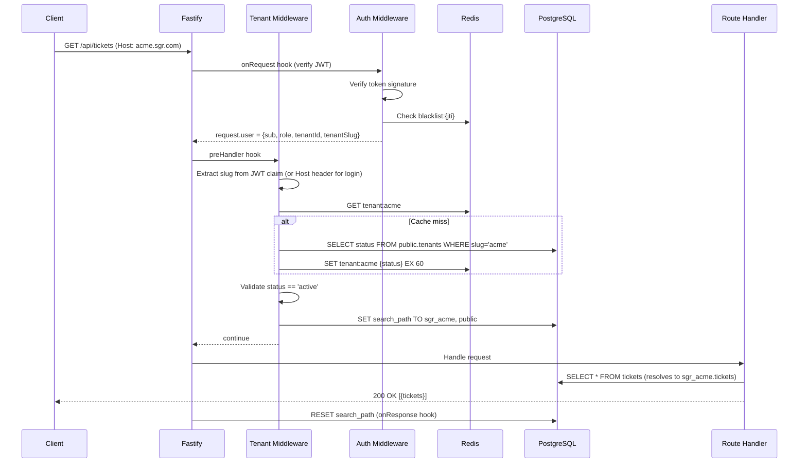
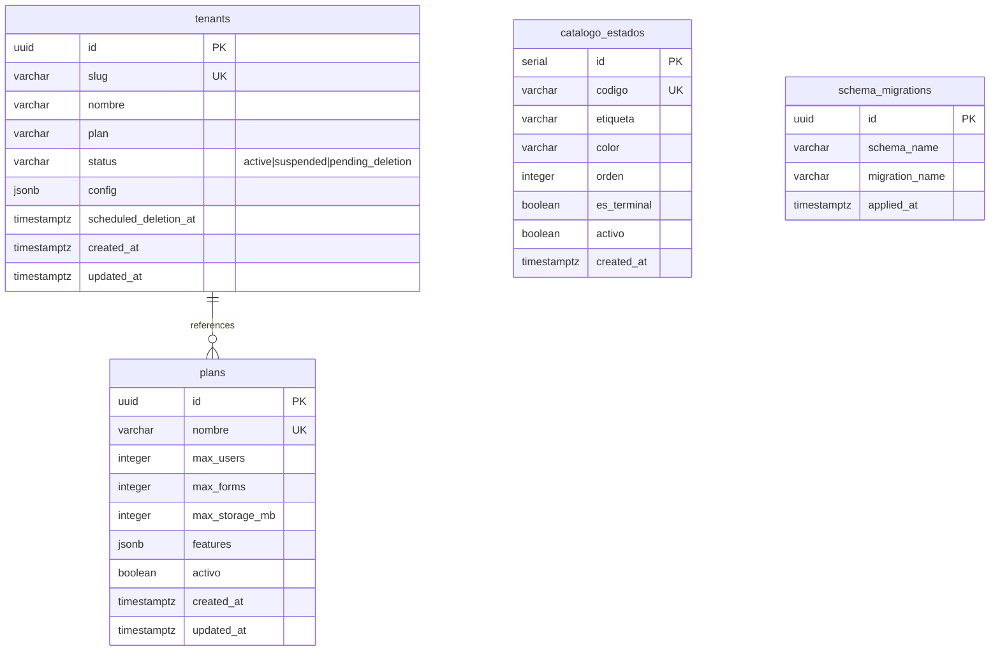
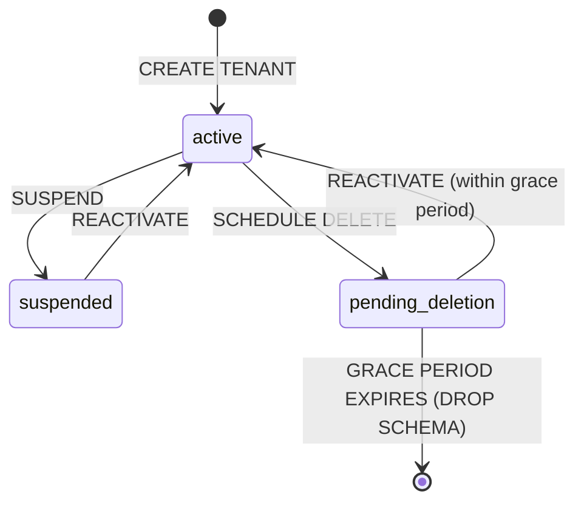

# Design Document — Multi-Tenant Schema per Tenant

## Overview

This design implements **schema-per-tenant** multi-tenancy for the SGR platform. Each tenant gets an isolated PostgreSQL schema (`sgr_{slug}`) containing the full set of ~17 business tables. A shared `public` schema holds platform-level tables (`tenants`, `plans`, `catalogo_estados`).

The key architectural insight is that PostgreSQL's `search_path` allows existing Drizzle ORM queries to work unchanged — by setting `search_path = sgr_{slug}, public` at the start of each request, all unqualified table references resolve to the tenant's schema first, falling back to `public` for shared catalogs.

### Design Goals

1. **Zero changes to existing SGR business code** — middleware sets context, queries run as before
2. **Strong data isolation** — schemas prevent accidental cross-tenant access
3. **Simple tenant lifecycle** — create/suspend/reactivate/delete with proper atomicity
4. **Incremental migration** — existing data moves to `sgr_default` schema seamlessly

### Non-Goals

- Per-tenant connection pools (single pool with per-request `search_path` is sufficient at current scale)
- Tenant-specific database users or Row-Level Security
- Multi-database approach (all tenants share one PostgreSQL instance)

## Architecture

```mermaid
graph TB
    subgraph "Frontend (Next.js)"
        FE[SGR Frontend]
        FEAdmin[Platform Admin Panel]
    end

    subgraph "Backend (Fastify)"
        MW[Tenant Resolution Middleware]
        AUTH[Auth Service]
        SGR[SGR Route Handlers]
        PLAT[Platform Routes]
        LIFECYCLE[Tenant Lifecycle Service]
    end

    subgraph "PostgreSQL"
        PUB[public schema<br/>tenants, plans, catalogo_estados]
        T1[sgr_acme schema<br/>users, forms, reactivos...]
        T2[sgr_default schema<br/>users, forms, reactivos...]
        TN[sgr_N schema...]
    end

    subgraph "Redis"
        CACHE[Tenant Cache<br/>{slug}:status]
        TOKENS[Token Store<br/>{slug}:refresh:{uid}:{jti}]
    end

    subgraph "S3 (Garage)"
        S3[{slug}/documents/{uuid}/{file}]
    end

    FE -->|subdomain: acme.sgr.com| MW
    FEAdmin -->|/api/platform/*| PLAT
    MW -->|resolve tenant| CACHE
    MW -->|SET search_path| T1
    MW --> SGR
    AUTH -->|tenant claims in JWT| TOKENS
    PLAT -->|CRUD tenants| PUB
    LIFECYCLE -->|CREATE/DROP SCHEMA| TN
    SGR -->|queries use search_path| T1
    SGR -->|file storage| S3
```

### Request Flow



## Components and Interfaces

### 1. Platform Schema (Drizzle definitions)

New file: `packages/backend/src/db/schema/platform.ts`

```typescript
// Platform-level tables in public schema
import { pgTable, pgSchema, uuid, varchar, boolean, timestamp, integer, jsonb } from 'drizzle-orm/pg-core';

export const tenants = pgTable('tenants', {
  id: uuid('id').primaryKey().defaultRandom(),
  slug: varchar('slug', { length: 50 }).notNull().unique(),
  nombre: varchar('nombre', { length: 255 }).notNull(),
  plan: varchar('plan', { length: 50 }).notNull().default('starter'),
  status: varchar('status', { length: 20 }).notNull().default('active'),
  config: jsonb('config').default({}),
  scheduledDeletionAt: timestamp('scheduled_deletion_at', { withTimezone: true }),
  createdAt: timestamp('created_at', { withTimezone: true }).notNull().defaultNow(),
  updatedAt: timestamp('updated_at', { withTimezone: true }).notNull().defaultNow(),
});

export const plans = pgTable('plans', {
  id: uuid('id').primaryKey().defaultRandom(),
  nombre: varchar('nombre', { length: 100 }).notNull().unique(),
  maxUsers: integer('max_users').notNull(),
  maxForms: integer('max_forms').notNull(),
  maxStorageMb: integer('max_storage_mb').notNull(),
  features: jsonb('features').default({}),
  activo: boolean('activo').notNull().default(true),
  createdAt: timestamp('created_at', { withTimezone: true }).notNull().defaultNow(),
  updatedAt: timestamp('updated_at', { withTimezone: true }).notNull().defaultNow(),
});
```

### 2. Tenant Resolution Middleware

New file: `packages/backend/src/modules/tenant/tenant.middleware.ts`

```typescript
interface TenantContext {
  tenantId: string;
  tenantSlug: string;
  schemaName: string;
}

// Registered as preHandler hook (after auth middleware)
// - For Platform routes (/api/platform/*): skip resolution, use public schema
// - For Auth routes (login): resolve from Host header subdomain
// - For SGR routes: resolve from JWT tenantSlug claim
// - Cache lookup in Redis (key: tenant:{slug}, TTL: 60s)
// - Validate tenant status (active required for SGR routes)
// - Execute: SET search_path TO sgr_{slug}, public
// - onResponse hook: RESET search_path (SET search_path TO public)
```

### 3. Tenant Lifecycle Service

New file: `packages/backend/src/modules/platform/tenant-lifecycle.service.ts`

```typescript
interface CreateTenantDTO {
  slug: string;
  nombre: string;
  plan: string;
  adminEmail: string;
  adminPassword: string;
}

interface TenantLifecycleService {
  createTenant(dto: CreateTenantDTO): Promise<Tenant>;
  suspendTenant(tenantId: string): Promise<Tenant>;
  activateTenant(tenantId: string): Promise<Tenant>;
  scheduleDeletion(tenantId: string): Promise<Tenant>;
  executePendingDeletions(): Promise<void>; // Cron job
}

// Creation flow (within transaction):
// 1. Validate slug format (regex: /^[a-z0-9][a-z0-9-]{1,48}[a-z0-9]$/)
// 2. INSERT INTO public.tenants
// 3. CREATE SCHEMA sgr_{slug}
// 4. Execute schema template SQL within new schema
// 5. INSERT admin user into sgr_{slug}.users
// 6. On any failure: DROP SCHEMA IF EXISTS sgr_{slug} CASCADE, rollback transaction
```

### 4. Schema Template

New file: `packages/backend/src/db/schema-template.sql`

A parameterized SQL script derived from `init.sql` that:
- Accepts `$SCHEMA_NAME` as parameter
- Creates all 17 tenant-scoped tables within `SET search_path TO $SCHEMA_NAME`
- Creates all indexes and triggers
- Seeds default SLA config
- Excludes `catalogo_estados`, `tenants`, `plans`

### 5. JWT Enhancement

Modified: `packages/backend/src/modules/auth/auth.service.ts`

```typescript
// Extended JWT payload
interface JWTPayload {
  sub: string;        // userId
  role: string;
  tenantId: string;   // NEW
  tenantSlug: string; // NEW
  iat: number;
  exp: number;
  jti: string;
}

// Login flow changes:
// 1. Resolve tenant from request subdomain (Host header)
// 2. SET search_path TO sgr_{slug}, public
// 3. Query users table (now resolves to tenant schema)
// 4. Include tenantId + tenantSlug in both access and refresh tokens
```

### 6. Redis Key Namespacing

Modified: `packages/backend/src/lib/redis.ts`

```typescript
// New helper for namespaced keys
export function tenantKey(tenantSlug: string, ...parts: string[]): string {
  return `${tenantSlug}:${parts.join(':')}`;
}

// Usage in auth service:
// Before: `refresh:${userId}:${jti}`
// After:  `${tenantSlug}:refresh:${userId}:${jti}`

// Before: `blacklist:${jti}`
// After:  `${tenantSlug}:blacklist:${jti}`
```

### 7. S3 Key Namespacing

Modified: `packages/backend/src/lib/minio.ts`

```typescript
// New helper for namespaced storage keys
export function tenantStorageKey(tenantSlug: string, path: string): string {
  return `${tenantSlug}/${path}`;
}

// Upload key format: {tenantSlug}/documents/{uuid}/{filename}
// Backward compat: non-prefixed keys map to "default" tenant
```

### 8. Platform Admin Routes

New file: `packages/backend/src/modules/platform/platform.routes.ts`

```typescript
// All routes under /api/platform/* prefix
// Protected by requireRole(['platform_admin']) guard
// Operate on public schema (no tenant resolution)

// POST   /api/platform/tenants         — Create tenant
// GET    /api/platform/tenants         — List tenants (paginated)
// GET    /api/platform/tenants/:id     — Tenant detail + metrics
// PUT    /api/platform/tenants/:id/suspend   — Suspend
// PUT    /api/platform/tenants/:id/activate  — Reactivate
// DELETE /api/platform/tenants/:id     — Schedule deletion
```

### 9. Cross-Schema Migration Runner

New file: `packages/backend/src/db/migration-runner.ts`

```typescript
interface MigrationRunner {
  // Discovers all tenant schemas (SELECT nspname FROM pg_namespace WHERE nspname LIKE 'sgr_%')
  // Applies migration to each schema within its own transaction
  // Logs errors per schema but continues to next
  // Records applied migrations in a tracking table per schema
  applyMigration(migrationPath: string): Promise<MigrationResult[]>;
}
```

### 10. Frontend Platform Admin Pages

New pages in `packages/frontend/src/app/admin/`:
- `/admin/tenants` — Tenant list table
- `/admin/tenants/nuevo` — Create tenant form
- `/admin/tenants/[id]` — Tenant detail + actions

Protected by `platform_admin` role guard in the frontend middleware.

## Data Models

### Platform Tables (public schema)



### Tenant Schema (sgr_{slug})

Each tenant schema contains an identical copy of:
- `users` — tenant's users with roles (admin, manager, tecnico, asistente)
- `forms`, `form_versions`, `form_assignments`
- `reactivos`, `state_transitions`
- `signatures`
- `observations`, `observation_files`
- `notifications`
- `audit_logs`
- `clientes`, `cliente_contactos`, `cliente_documentos`
- `tickets`, `sla_config`, `reglas_asignacion`

### Tenant State Machine



### JWT Payload Structure (Updated)

```json
{
  "sub": "uuid-user-id",
  "role": "admin",
  "tenantId": "uuid-tenant-id",
  "tenantSlug": "acme",
  "iat": 1700000000,
  "exp": 1700000900,
  "jti": "uuid-token-id"
}
```

### Redis Key Patterns

| Purpose | Key Pattern | TTL |
|---------|------------|-----|
| Tenant status cache | `tenant:{slug}` | 60s |
| Refresh token | `{slug}:refresh:{userId}:{jti}` | 7d |
| Token blacklist | `{slug}:blacklist:{jti}` | 15m |
| BullMQ queues | `{slug}:queue:{name}` | — |

### S3 Key Pattern

```
{tenantSlug}/documents/{uuid}/{originalFilename}
```

Backward compatibility: existing keys without prefix are mapped to `default/` prefix during reads.

## Correctness Properties

*A property is a characteristic or behavior that should hold true across all valid executions of a system — essentially, a formal statement about what the system should do. Properties serve as the bridge between human-readable specifications and machine-verifiable correctness guarantees.*

### Property 1: Slug Validation

*For any* string, the tenant creation endpoint SHALL accept it if and only if it matches `^[a-z0-9][a-z0-9-]{1,48}[a-z0-9]$` (3-50 chars, lowercase alphanumeric and hyphens, no leading/trailing hyphens).

**Validates: Requirements 4.6**

### Property 2: Tenant Creation Atomicity

*For any* valid tenant creation request, either all artifacts are created (tenant record + schema + tables + admin user) and the operation succeeds, or none of them exist and the operation returns an error.

**Validates: Requirements 4.1, 4.2, 4.5**

### Property 3: Schema Template Correctness

*For any* valid schema name, executing the schema template SHALL produce exactly the 17 expected tenant tables, all expected indexes, and the audit_logs trigger within that schema, and SHALL NOT produce any platform-only tables (tenants, plans, catalogo_estados).

**Validates: Requirements 2.1, 2.4, 2.6**

### Property 4: Tenant Resolution from Request Context

*For any* HTTP request with a valid JWT containing a `tenantSlug` claim, the tenant resolution middleware SHALL extract and use that slug. *For any* login request with a Host header containing a subdomain, the system SHALL extract the first subdomain label as the tenant slug.

**Validates: Requirements 3.1, 3.2**

### Property 5: Search Path Enforcement

*For any* resolved active tenant with slug S, the database connection's `search_path` SHALL be set to `sgr_S, public` before any route handler query executes, and SHALL be reset to `public` after the response completes.

**Validates: Requirements 3.3, 15.1, 15.2**

### Property 6: Non-Active Tenant Rejection

*For any* tenant with status `suspended` or `pending_deletion`, all SGR route requests targeting that tenant SHALL receive HTTP 403.

**Validates: Requirements 3.5, 5.2, 6.2**

### Property 7: Lifecycle State Machine Validity

*For any* tenant, the only valid state transitions are: `active → suspended`, `suspended → active`, `active → pending_deletion`, `pending_deletion → active`. Any other transition attempt SHALL return HTTP 409.

**Validates: Requirements 5.1, 5.3, 5.5, 5.6, 6.1, 6.4**

### Property 8: JWT Contains All Required Claims

*For any* successful authentication, the generated JWT SHALL contain all of: `sub`, `role`, `tenantId`, `tenantSlug`, `iat`, `exp`, `jti`.

**Validates: Requirements 7.1, 7.2, 7.5**

### Property 9: Redis Key Namespacing

*For any* Redis key written by an SGR route handler in the context of tenant with slug S, the key SHALL be prefixed with `S:`. Specifically, refresh tokens follow `S:refresh:{userId}:{jti}` and blacklist entries follow `S:blacklist:{jti}`.

**Validates: Requirements 9.1, 9.2, 9.3, 9.4**

### Property 10: S3 Key Namespacing

*For any* file stored for a tenant with slug S, the S3 object key SHALL begin with `S/`. *For any* file retrieval in tenant context S, the S3 key lookup SHALL use the `S/` prefix.

**Validates: Requirements 10.1, 10.2**

### Property 11: Connection Pool Isolation

*For any* two concurrent requests targeting different tenants A and B, the queries executed by request A SHALL only see data in `sgr_A` and the queries executed by request B SHALL only see data in `sgr_B`, with no cross-contamination.

**Validates: Requirements 15.3**

### Property 12: Default Tenant Fallback

*For any* HTTP request where the Host header has no subdomain (e.g., `localhost`, `127.0.0.1`, bare domain), the tenant resolution middleware SHALL resolve to the `default` tenant.

**Validates: Requirements 11.5**

### Property 13: Platform Route Bypass

*For any* request to a URL matching `/api/platform/*`, the tenant resolution middleware SHALL set `search_path` to `public` only, without requiring tenant resolution.

**Validates: Requirements 3.6**

### Property 14: Platform Admin Access Control

*For any* request to a platform route from a user whose JWT role is NOT `platform_admin`, the system SHALL respond with HTTP 403.

**Validates: Requirements 8.7**

### Property 15: Duplicate Slug Rejection

*For any* tenant creation request where the slug already exists in the `tenants` table, the system SHALL respond with HTTP 409.

**Validates: Requirements 4.7, 1.3**

### Property 16: Migration Runner Applies to All Schemas

*For any* migration execution, the runner SHALL apply the migration to every schema matching `sgr_*` in `pg_namespace`, and SHALL record the application to prevent duplicate execution on subsequent runs.

**Validates: Requirements 12.1, 12.3**

## Error Handling

### Error Codes

| Code | HTTP | Condition |
|------|------|-----------|
| `TENANT_NOT_FOUND` | 404 | Slug doesn't match any tenant record |
| `TENANT_SUSPENDED` | 403 | Tenant status is `suspended` or `pending_deletion` |
| `TENANT_SLUG_EXISTS` | 409 | Slug already taken |
| `INVALID_TENANT_STATE` | 409 | Invalid state transition attempted |
| `INVALID_TENANT_SLUG` | 422 | Slug format validation failed |
| `PLATFORM_ACCESS_DENIED` | 403 | Non-platform_admin accessing platform routes |
| `TENANT_CREATION_FAILED` | 500 | Schema provisioning failed (after rollback) |

### Error Response Format

Follows existing SGR error format:

```json
{
  "statusCode": 403,
  "code": "TENANT_SUSPENDED",
  "message": "El tenant se encuentra suspendido",
  "timestamp": "2024-01-01T00:00:00.000Z",
  "requestId": "req-123"
}
```

### Failure Scenarios

1. **Schema creation failure** — Transaction rollback removes tenant record; returns 500
2. **Redis unavailable** — Middleware falls through to DB lookup (degraded performance, not failure)
3. **Concurrent tenant creation with same slug** — PostgreSQL UNIQUE constraint ensures only one succeeds; second gets 409
4. **Connection pool exhaustion** — Standard Fastify 503; no special multi-tenant handling needed
5. **Migration failure in one schema** — Logged, other schemas continue; admin notified

## Testing Strategy

### Property-Based Testing

This feature is well-suited for property-based testing due to:
- Clear input/output behavior in validation functions (slug format)
- Universal properties across all tenants (search_path, key namespacing)
- State machine with well-defined valid/invalid transitions
- Isolation guarantees that should hold for arbitrary concurrent scenarios

**Library:** [fast-check](https://github.com/dubzzz/fast-check) (TypeScript PBT library)

**Configuration:**
- Minimum 100 iterations per property test
- Each test tagged: `Feature: multi-tenant-schema, Property {N}: {description}`

**Properties to test with PBT:**
- Property 1 (slug validation): Generate random strings, verify accept/reject matches regex
- Property 7 (state machine): Generate random sequences of lifecycle commands, verify only valid transitions succeed
- Property 9 (Redis namespacing): Generate random slugs and key parts, verify format
- Property 10 (S3 namespacing): Generate random slugs and paths, verify format
- Property 15 (duplicate slug): Generate slugs, verify second creation always fails

### Unit Tests (Example-Based)

- Tenant creation happy path with specific valid inputs
- JWT generation includes tenant claims (decode and verify)
- Schema template execution creates all expected tables
- Error response format matches specification
- Middleware correctly identifies platform routes vs SGR routes

### Integration Tests

- End-to-end tenant creation → login → query flow
- Concurrent requests to different tenants see isolated data
- Tenant suspension blocks subsequent requests
- Deletion cleanup removes schema, Redis keys, and S3 objects
- Migration runner applies changes to all existing schemas
- Existing `sgr_default` data accessible after migration

### Test Environment

- Separate PostgreSQL database for tests (`sgr_test`)
- Redis instance with separate DB number
- Mock S3 (or test Garage instance)
- Tests create/destroy schemas per test suite (cleanup after)
