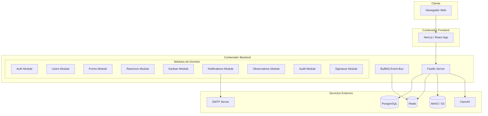
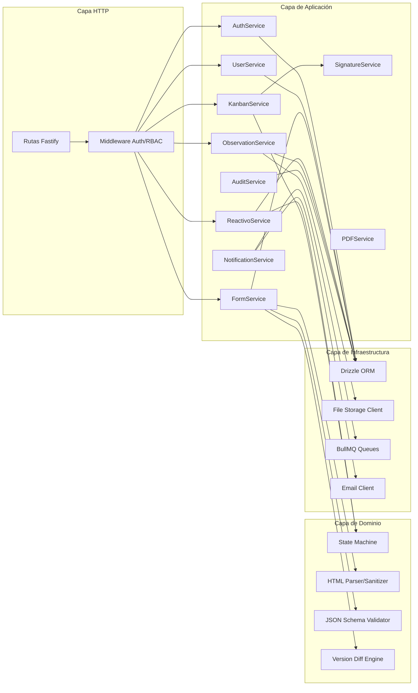
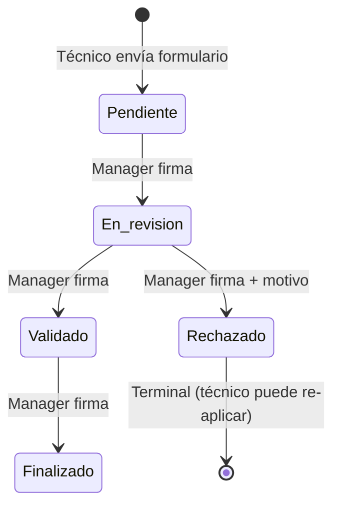

# Documento de Diseño Técnico — Sistema de Gestión de Reactivos (SGR)

## Visión General

El SGR es una aplicación web de dos contenedores (frontend + backend) que gestiona el ciclo de vida de reactivos aplicados por técnicos de campo. El sistema implementa un flujo de trabajo basado en formularios HTML con control de versiones, un tablero Kanban con máquina de estados unidireccional, firma digital con integridad criptográfica, y un sistema de notificaciones en tiempo real.

### Decisiones Técnicas Clave

| Componente | Tecnología |
|---|---|
| Frontend | React/Next.js en contenedor Node.js |
| Backend | Fastify + TypeScript en contenedor Node.js |
| Base de datos | PostgreSQL con JSONB para respuestas de formularios |
| ORM | Drizzle ORM con soporte nativo JSONB |
| Validación | Zod (validación + generación OpenAPI) |
| Autenticación | JWT RS256 con librería `jose` |
| Bus de eventos | BullMQ (colas persistentes para notificaciones y tareas asíncronas) |
| Generación PDF | pdfkit |
| Escaneo archivos | ClamAV |
| Documentación API | OpenAPI/Swagger auto-generado desde esquemas Zod |

---

## Arquitectura

### Diagrama de Contenedores



### Diagrama de Módulos del Backend



### Máquina de Estados del Reactivo



---

## Componentes e Interfaces

### 1. Módulo de Autenticación (AuthModule)

**Responsabilidad:** Gestión de sesiones JWT RS256, login, logout, refresh tokens.

```typescript
// Interfaces principales
interface AuthService {
  login(credentials: LoginDTO): Promise<TokenPair>;
  refresh(refreshToken: string): Promise<TokenPair>;
  logout(userId: string): Promise<void>;
  verifyToken(token: string): Promise<JWTPayload>;
}

interface TokenPair {
  accessToken: string;   // Expira en 15 min (configurable)
  refreshToken: string;  // Expira en 7 días, rotación obligatoria
}

interface JWTPayload {
  sub: string;           // userId
  role: Role;
  iat: number;
  exp: number;
}
```

**Implementación:**
- Firma asimétrica RS256 con `jose` (clave privada en backend, pública para verificación)
- Refresh tokens almacenados en Redis con TTL de 7 días
- Rotación de refresh token en cada uso (el anterior se invalida)
- Blacklist de tokens revocados en Redis

### 2. Módulo de Usuarios (UserModule)

**Responsabilidad:** CRUD de perfiles con control de acceso por rol.

```typescript
interface UserService {
  create(data: CreateUserDTO, actor: Actor): Promise<User>;
  update(id: string, data: UpdateUserDTO, actor: Actor): Promise<User>;
  deactivate(id: string, actor: Actor): Promise<void>;
  delete(id: string, actor: Actor): Promise<void>;
  findById(id: string): Promise<User | null>;
  findAll(filters: UserFilters): Promise<PaginatedResult<User>>;
}

// Reglas de negocio:
// - Superusuario: CRUD sobre Admin, Manager, Técnico
// - Administrador: CRUD sobre Manager y Técnico (no puede tocar Superusuario)
// - Desactivar = revocar sesión inmediatamente (eliminar tokens de Redis)
```

### 3. Módulo de Formularios (FormModule)

**Responsabilidad:** Creación de formularios HTML, versionado, sanitización, generación de esquema JSON.

```typescript
interface FormService {
  create(html: string, metadata: FormMetadata, actor: Actor): Promise<Form>;
  update(id: string, html: string, actor: Actor): Promise<FormUpdateResult>;
  activate(id: string, actor: Actor): Promise<void>;
  deactivate(id: string, actor: Actor): Promise<void>;
  getVersionHistory(formId: string): Promise<FormVersion[]>;
  getSchema(formId: string, version: number): Promise<JSONSchema>;
}

interface FormUpdateResult {
  type: 'aesthetic' | 'structural';
  form: Form;
  newVersion?: FormVersion;  // Solo si es cambio estructural
}

interface HTMLParser {
  parse(html: string): ParsedForm;
  sanitize(html: string): string;
  extractFields(html: string): FormField[];
  detectChanges(oldFields: FormField[], newFields: FormField[]): ChangeType;
  generateSchema(fields: FormField[]): JSONSchema;
}
```

**Lógica de versionado:**
1. Se parsea el HTML y se extraen los campos (`<input>`, `<select>`, `<textarea>`, etc.)
2. Se comparan los campos con la versión actual (por `name`, tipo, y presencia)
3. Si hay cambios estructurales → nueva versión con nuevo esquema JSON
4. Si solo hay cambios estéticos → actualización in-place sin nueva versión
5. El esquema JSON se genera automáticamente a partir de los campos extraídos

### 4. Módulo de Reactivos (ReactivoModule)

**Responsabilidad:** Creación de reactivos, gestión de intentos, generación de PDF.

```typescript
interface ReactivoService {
  create(formId: string, responses: Record<string, unknown>, actor: Actor): Promise<Reactivo>;
  reapply(parentReactivoId: string, responses: Record<string, unknown>, actor: Actor): Promise<Reactivo>;
  getById(id: string): Promise<ReactivoDetail>;
  getByTecnico(tecnicoId: string, filters: ReactivoFilters): Promise<PaginatedResult<Reactivo>>;
  generatePDF(reactivoId: string): Promise<Buffer>;
  getAttemptChain(reactivoId: string): Promise<Reactivo[]>;
}
```

### 5. Módulo Kanban (KanbanModule)

**Responsabilidad:** Tablero visual, transiciones de estado con firma digital.

```typescript
interface KanbanService {
  getBoard(filters: KanbanFilters): Promise<KanbanBoard>;
  transition(reactivoId: string, newState: ReactivoState, signature: SignatureInput, actor: Actor, reason?: string): Promise<void>;
  getDetail(reactivoId: string): Promise<ReactivoDetail>;
}

interface KanbanBoard {
  columns: {
    pendiente: KanbanCard[];
    en_revision: KanbanCard[];
    validado: KanbanCard[];
    rechazado: KanbanCard[];
    finalizado: KanbanCard[];
  };
}

// Transiciones válidas (máquina de estados unidireccional)
const VALID_TRANSITIONS: Record<ReactivoState, ReactivoState[]> = {
  pendiente: ['en_revision'],
  en_revision: ['validado', 'rechazado'],
  validado: ['finalizado'],
  rechazado: [],       // Estado terminal
  finalizado: [],      // Estado terminal
};
```

### 6. Módulo de Firma Digital (SignatureModule)

**Responsabilidad:** Captura, almacenamiento seguro y verificación de integridad de firmas.

```typescript
interface SignatureService {
  capture(input: SignatureInput): Promise<SignatureRecord>;
  verify(signatureId: string): Promise<boolean>;
  getByUser(userId: string): Promise<SignatureRecord | null>;
}

interface SignatureInput {
  type: 'upload' | 'canvas';
  imageData: Buffer;  // PNG de la firma
}

interface SignatureRecord {
  id: string;
  userId: string;
  imageHash: string;        // SHA-256 de la imagen
  encryptedImage: Buffer;   // Imagen cifrada con pgcrypto
  createdAt: Date;
}
```

**Integridad criptográfica:**
- Se calcula SHA-256 de la imagen de firma
- Se almacena el hash junto con la imagen cifrada
- En cada transición de estado se registra: `signatureHash + timestamp + userId + reactivoId`
- Se genera un HMAC del registro completo para detectar manipulaciones

### 7. Módulo de Observaciones (ObservationModule)

**Responsabilidad:** Gestión de observaciones con archivos adjuntos.

```typescript
interface ObservationService {
  create(reactivoId: string, data: CreateObservationDTO, files: UploadedFile[], actor: Actor): Promise<Observation>;
  markAsRead(observationId: string, actor: Actor): Promise<void>;
  getByReactivo(reactivoId: string): Promise<Observation[]>;
  getUnreadByTecnico(tecnicoId: string): Promise<Observation[]>;
}

interface FileValidation {
  validateSize(file: UploadedFile, maxSizeMB: number): boolean;
  validateFormat(file: UploadedFile, allowedFormats: string[]): boolean;
  scanForMalware(file: UploadedFile): Promise<ScanResult>;
}
```

### 8. Módulo de Notificaciones (NotificationModule)

**Responsabilidad:** Envío de notificaciones push y email mediante colas asíncronas.

```typescript
interface NotificationService {
  send(notification: NotificationPayload): Promise<void>;
  getByUser(userId: string, filters: NotifFilters): Promise<PaginatedResult<Notification>>;
  markAsRead(notificationId: string, actor: Actor): Promise<void>;
}

interface NotificationPayload {
  recipientId: string;
  type: NotificationType;
  channels: ('push' | 'email')[];
  data: {
    reactivoId?: string;
    previousState?: ReactivoState;
    newState?: ReactivoState;
    reason?: string;
    actorName: string;
    timestamp: Date;
  };
}
```

**Implementación con BullMQ:**
- Cola `notifications:push` para notificaciones in-app (WebSocket/SSE)
- Cola `notifications:email` para envío de correos
- Workers separados para cada canal
- Reintentos automáticos con backoff exponencial

### 9. Módulo de Auditoría (AuditModule)

**Responsabilidad:** Registro inmutable de todas las operaciones críticas.

```typescript
interface AuditService {
  log(entry: AuditEntry): Promise<void>;
  query(filters: AuditFilters): Promise<PaginatedResult<AuditLog>>;
}

interface AuditEntry {
  action: AuditAction;
  entityType: string;
  entityId: string;
  actorId: string;
  actorRole: Role;
  ipAddress: string;
  details: Record<string, unknown>;
  timestamp: Date;
}
```

**Implementación append-only:**
- Tabla con política `INSERT ONLY` (sin UPDATE ni DELETE a nivel de BD)
- Trigger PostgreSQL que previene modificaciones
- Particionamiento por mes para rendimiento

---

## Modelos de Datos

### Diagrama Entidad-Relación

```mermaid
erDiagram
    users ||--o{ reactivos : "genera"
    users ||--o{ form_assignments : "recibe"
    users ||--o{ observations : "crea"
    users ||--o{ audit_logs : "ejecuta"
    users ||--o{ notifications : "recibe"
    users ||--o{ signatures : "posee"

    forms ||--o{ form_versions : "tiene"
    forms ||--o{ form_assignments : "asignado_a"
    form_versions ||--o{ reactivos : "responde_a"

    reactivos ||--o{ state_transitions : "historial"
    reactivos ||--o{ observations : "tiene"
    reactivos ||--o{ reactivos : "padre_hijo"

    state_transitions ||--|| signatures : "firmado_por"

    observations ||--o{ observation_files : "adjuntos"

    users {
        uuid id PK
        varchar email UK
        varchar password_hash
        enum role
        varchar name
        boolean is_active
        timestamp created_at
        timestamp updated_at
    }

    forms {
        uuid id PK
        varchar name
        varchar slug UK
        boolean is_active
        uuid created_by FK
        uuid parent_form_id FK
        integer current_version
        timestamp created_at
        timestamp updated_at
    }

    form_versions {
        uuid id PK
        uuid form_id FK
        integer version_number
        text html_content
        text sanitized_html
        jsonb json_schema
        jsonb fields_metadata
        varchar change_type
        uuid created_by FK
        timestamp created_at
    }

    form_assignments {
        uuid id PK
        uuid form_id FK
        uuid tecnico_id FK
        uuid assigned_by FK
        boolean is_active
        timestamp created_at
        timestamp revoked_at
    }

    reactivos {
        uuid id PK
        uuid form_id FK
        uuid form_version_id FK
        uuid tecnico_id FK
        uuid parent_reactivo_id FK
        integer attempt_number
        enum state
        jsonb responses
        varchar rejection_reason
        timestamp created_at
        timestamp updated_at
    }

    state_transitions {
        uuid id PK
        uuid reactivo_id FK
        enum from_state
        enum to_state
        uuid actor_id FK
        uuid signature_id FK
        varchar reason
        varchar ip_address
        timestamp created_at
    }

    signatures {
        uuid id PK
        uuid user_id FK
        enum type
        bytea encrypted_image
        varchar image_hash
        varchar hmac
        timestamp created_at
    }

    observations {
        uuid id PK
        uuid reactivo_id FK
        uuid author_id FK
        text content
        boolean is_read
        timestamp read_at
        timestamp created_at
    }

    observation_files {
        uuid id PK
        uuid observation_id FK
        varchar original_name
        varchar storage_key
        varchar mime_type
        integer size_bytes
        varchar scan_status
        timestamp created_at
    }

    notifications {
        uuid id PK
        uuid recipient_id FK
        enum type
        jsonb payload
        boolean is_read
        timestamp read_at
        timestamp created_at
    }

    audit_logs {
        uuid id PK
        varchar action
        varchar entity_type
        uuid entity_id
        uuid actor_id FK
        varchar actor_role
        varchar ip_address
        jsonb details
        timestamp created_at
    }
}
```

### Esquemas Drizzle ORM (Principales)

```typescript
// Enum de roles
export const roleEnum = pgEnum('role', [
  'superusuario',
  'administrador', 
  'manager',
  'tecnico_de_campo'
]);

// Enum de estados del reactivo
export const reactivoStateEnum = pgEnum('reactivo_state', [
  'pendiente',
  'en_revision',
  'validado',
  'rechazado',
  'finalizado'
]);

// Tabla de usuarios
export const users = pgTable('users', {
  id: uuid('id').primaryKey().defaultRandom(),
  email: varchar('email', { length: 255 }).unique().notNull(),
  passwordHash: varchar('password_hash', { length: 255 }).notNull(),
  name: varchar('name', { length: 255 }).notNull(),
  role: roleEnum('role').notNull(),
  isActive: boolean('is_active').default(true).notNull(),
  createdAt: timestamp('created_at').defaultNow().notNull(),
  updatedAt: timestamp('updated_at').defaultNow().notNull(),
});

// Tabla de reactivos con JSONB
export const reactivos = pgTable('reactivos', {
  id: uuid('id').primaryKey().defaultRandom(),
  formId: uuid('form_id').references(() => forms.id).notNull(),
  formVersionId: uuid('form_version_id').references(() => formVersions.id).notNull(),
  tecnicoId: uuid('tecnico_id').references(() => users.id).notNull(),
  parentReactivoId: uuid('parent_reactivo_id').references(() => reactivos.id),
  attemptNumber: integer('attempt_number').notNull().default(1),
  state: reactivoStateEnum('state').notNull().default('pendiente'),
  responses: jsonb('responses').notNull(),  // Validado contra json_schema de la versión
  rejectionReason: varchar('rejection_reason', { length: 1000 }),
  createdAt: timestamp('created_at').defaultNow().notNull(),
  updatedAt: timestamp('updated_at').defaultNow().notNull(),
});

// Tabla de auditoría (append-only)
export const auditLogs = pgTable('audit_logs', {
  id: uuid('id').primaryKey().defaultRandom(),
  action: varchar('action', { length: 100 }).notNull(),
  entityType: varchar('entity_type', { length: 100 }).notNull(),
  entityId: uuid('entity_id').notNull(),
  actorId: uuid('actor_id').references(() => users.id).notNull(),
  actorRole: varchar('actor_role', { length: 50 }).notNull(),
  ipAddress: varchar('ip_address', { length: 45 }).notNull(),
  details: jsonb('details'),
  createdAt: timestamp('created_at').defaultNow().notNull(),
});
```

### Estrategia JSONB para Respuestas de Formularios

Las respuestas de formularios se almacenan en una columna `responses JSONB` en la tabla `reactivos`. Cada versión de formulario tiene un `json_schema` asociado que define la estructura esperada.

**Flujo de validación:**
1. Técnico envía respuestas → Backend recibe JSON
2. Se obtiene el `json_schema` de la versión del formulario asignado
3. Se valida el JSON contra el esquema usando Zod (esquema generado dinámicamente)
4. Si es válido → se persiste en la columna JSONB
5. Si es inválido → se rechaza con errores detallados

**Índices GIN para consultas:**
```sql
CREATE INDEX idx_reactivos_responses ON reactivos USING GIN (responses);
CREATE INDEX idx_reactivos_state ON reactivos (state);
CREATE INDEX idx_reactivos_tecnico_id ON reactivos (tecnico_id);
CREATE INDEX idx_reactivos_form_version ON reactivos (form_version_id);
```

---

## Propiedades de Correctitud

*Una propiedad es una característica o comportamiento que debe mantenerse verdadero en todas las ejecuciones válidas de un sistema — esencialmente, una declaración formal sobre lo que el sistema debe hacer. Las propiedades sirven como puente entre especificaciones legibles por humanos y garantías de correctitud verificables por máquinas.*

### Propiedad 1: Control de Acceso en Gestión de Usuarios

*Para cualquier* actor con rol R y cualquier usuario objetivo con rol T, la operación de gestión (crear/editar/desactivar/eliminar) debe tener éxito si y solo si la jerarquía de roles lo permite: Superusuario puede gestionar {Administrador, Manager, Técnico_de_Campo}; Administrador puede gestionar {Manager, Técnico_de_Campo}; cualquier otro rol es denegado.

**Valida: Requerimientos 1.1, 1.2, 1.3**

### Propiedad 2: Revocación de Sesión por Desactivación

*Para cualquier* usuario activo con tokens válidos, al desactivar su perfil, todas las verificaciones de token posteriores deben fallar (retornar 401).

**Valida: Requerimientos 1.4**

### Propiedad 3: Prevención de Asignación de Formularios Inactivos

*Para cualquier* formulario con estado `is_active=false` y cualquier técnico, todo intento de asignación debe ser rechazado por el sistema.

**Valida: Requerimientos 2.3, 4.5**

### Propiedad 4: Round-Trip de Parseo/Renderizado HTML

*Para cualquier* formulario HTML válido, parsear el HTML y luego renderizarlo debe producir una estructura de campos equivalente al HTML original (los campos extraídos deben preservar nombre, tipo y restricciones).

**Valida: Requerimientos 3.1, 3.7**

### Propiedad 5: Cambio Estructural Crea Nueva Versión

*Para cualquier* formulario existente y cualquier modificación que añada, elimine o renombre campos, el sistema debe crear una nueva versión con un nuevo esquema JSON, incrementando el número de versión.

**Valida: Requerimientos 3.2**

### Propiedad 6: Cambio Estético Preserva Versión

*Para cualquier* formulario existente y cualquier modificación que solo altere estilos CSS, textos de ayuda u orden visual (sin cambiar nombres, tipos o cantidad de campos), el número de versión debe permanecer sin cambios.

**Valida: Requerimientos 3.3**

### Propiedad 7: Conformidad de Esquema JSONB

*Para cualquier* documento JSON y cualquier esquema de versión de formulario, el sistema debe persistir el documento si y solo si cumple con el esquema JSON definido. Documentos no conformes deben ser rechazados con errores de validación.

**Valida: Requerimientos 3.4, 3.8**

### Propiedad 8: Sanitización HTML Elimina Contenido Malicioso

*Para cualquier* entrada HTML que contenga scripts, event handlers (onclick, onerror, etc.), iframes, o elementos potencialmente peligrosos, la salida sanitizada no debe contener ninguno de esos elementos.

**Valida: Requerimientos 3.5**

### Propiedad 9: Invariante de Auditoría

*Para cualquier* operación crítica (creación/modificación de formularios, transiciones de estado, observaciones, intentos de acceso no autorizado), debe existir un registro de auditoría correspondiente con actor, timestamp, IP y detalle de la operación.

**Valida: Requerimientos 3.6, 10.5, 11.3**

### Propiedad 10: Revocación de Asignación Remueve Formulario

*Para cualquier* asignación que es revocada, el formulario no debe aparecer en la lista "Mis formularios" del técnico en consultas posteriores.

**Valida: Requerimientos 4.4**

### Propiedad 11: Aislamiento de Formularios del Técnico

*Para cualquier* técnico, la lista de formularios retornada por "Mis formularios" debe contener exactamente el conjunto de formularios con asignación activa para ese técnico, sin incluir formularios de otros técnicos ni formularios no asignados.

**Valida: Requerimientos 5.1**

### Propiedad 12: Estado Inicial del Reactivo

*Para cualquier* envío válido de formulario por un técnico (primera aplicación), el reactivo resultante debe tener `state='pendiente'` y `attempt_number=1`.

**Valida: Requerimientos 5.2**

### Propiedad 13: Máquina de Estados — Solo Transiciones Válidas

*Para cualquier* reactivo en estado S y cualquier estado destino T, la transición debe tener éxito si y solo si T está en el conjunto de transiciones válidas desde S: {pendiente→en_revisión, en_revisión→validado, en_revisión→rechazado, validado→finalizado}. Toda transición no definida debe ser rechazada.

**Valida: Requerimientos 6.2, 6.3**

### Propiedad 14: Transición Requiere Firma Digital

*Para cualquier* intento de transición de estado sin una firma digital válida asociada, el sistema debe rechazar la operación.

**Valida: Requerimientos 6.4, 9.4**

### Propiedad 15: Rechazo Requiere Motivo

*Para cualquier* transición al estado 'rechazado' sin un motivo de rechazo proporcionado (texto no vacío), el sistema debe rechazar la operación.

**Valida: Requerimientos 6.5**

### Propiedad 16: Acceso Diferenciado al Kanban por Rol

*Para cualquier* operación de escritura en el Kanban (mover tarjeta, firmar, agregar observación) intentada por un usuario con rol Superusuario o Administrador, el sistema debe denegar la operación. Solo el Manager puede ejecutar operaciones de escritura.

**Valida: Requerimientos 6.7, 6.8**

### Propiedad 17: Monotonía de Intentos en Re-aplicación

*Para cualquier* cadena de reactivos re-aplicados, el `attempt_number` de cada reactivo hijo debe ser estrictamente igual a `attempt_number` del padre + 1, y el `parent_reactivo_id` debe apuntar al reactivo rechazado inmediatamente anterior.

**Valida: Requerimientos 7.2, 7.5**

### Propiedad 18: Notificación por Cambio de Estado

*Para cualquier* transición de estado de un reactivo, el sistema debe generar una notificación dirigida al técnico que generó el reactivo, conteniendo: estado anterior, estado nuevo, responsable del cambio, timestamp, y motivo (si la transición es a 'rechazado').

**Valida: Requerimientos 7.1, 8.1, 8.2**

### Propiedad 19: Observación Requiere Texto

*Para cualquier* intento de crear una observación con texto vacío o ausente, el sistema debe rechazar la operación.

**Valida: Requerimientos 10.2**

### Propiedad 20: Validación de Archivos Adjuntos

*Para cualquier* archivo adjunto, el sistema debe rechazarlo si su tamaño excede 10 MB o si su formato no está en el conjunto permitido {jpg, png, pdf, doc, docx, xls, xlsx}. Archivos que cumplen ambas restricciones deben ser aceptados.

**Valida: Requerimientos 10.3, 10.4, 10.10, 10.11**

### Propiedad 21: Indicador de Observaciones No Leídas

*Para cualquier* reactivo, los datos de la tarjeta Kanban deben incluir un indicador de observaciones no leídas si y solo si existen observaciones asociadas a ese reactivo que no han sido marcadas como leídas por el técnico.

**Valida: Requerimientos 10.9**

### Propiedad 22: Consistencia de Control de Acceso (RBAC)

*Para cualquier* combinación de rol y funcionalidad del sistema, la decisión de acceso en la capa de API debe ser idéntica a la decisión de acceso en la interfaz de usuario. Si la API permite una operación para un rol, la UI debe mostrar el control correspondiente, y viceversa.

**Valida: Requerimientos 11.2, 11.4, 11.6**

### Propiedad 23: Autenticación Obligatoria

*Para cualquier* endpoint de la API (excepto login y health check), una solicitud sin token de autenticación válido debe ser rechazada con código 401.

**Valida: Requerimientos 11.1, 11.5**

---

## Manejo de Errores

### Estrategia General

El sistema implementa un manejo de errores estructurado con códigos de error tipados y respuestas consistentes.

```typescript
// Estructura de error estándar
interface APIError {
  statusCode: number;
  code: string;           // Código interno (e.g., 'FORM_INACTIVE')
  message: string;        // Mensaje legible en español
  details?: unknown;      // Detalles adicionales (errores de validación, etc.)
  timestamp: string;
  requestId: string;
}

// Códigos de error por dominio
enum AuthErrorCode {
  INVALID_CREDENTIALS = 'AUTH_001',
  TOKEN_EXPIRED = 'AUTH_002',
  TOKEN_INVALID = 'AUTH_003',
  SESSION_REVOKED = 'AUTH_004',
  INSUFFICIENT_PERMISSIONS = 'AUTH_005',
}

enum FormErrorCode {
  FORM_NOT_FOUND = 'FORM_001',
  FORM_INACTIVE = 'FORM_002',
  HTML_PARSE_ERROR = 'FORM_003',
  HTML_SANITIZATION_FAILED = 'FORM_004',
  STRUCTURAL_CHANGE_DETECTED = 'FORM_005',
  SCHEMA_VALIDATION_FAILED = 'FORM_006',
}

enum ReactivoErrorCode {
  INVALID_TRANSITION = 'REACTIVO_001',
  SIGNATURE_REQUIRED = 'REACTIVO_002',
  REASON_REQUIRED = 'REACTIVO_003',
  NOT_REJECTED = 'REACTIVO_004',
  FORM_NOT_ASSIGNED = 'REACTIVO_005',
}

enum FileErrorCode {
  FILE_TOO_LARGE = 'FILE_001',
  INVALID_FORMAT = 'FILE_002',
  MALWARE_DETECTED = 'FILE_003',
  SCAN_FAILED = 'FILE_004',
}
```

### Manejo por Capa

| Capa | Estrategia |
|------|-----------|
| **Validación (Zod)** | Errores 400 con detalle de campos inválidos |
| **Autenticación** | 401 para tokens inválidos/expirados, 403 para permisos insuficientes |
| **Dominio** | Errores de negocio con códigos específicos (409 para conflictos, 422 para reglas violadas) |
| **Infraestructura** | 500 con logging detallado, respuesta genérica al cliente |
| **Archivos** | 413 para tamaño excedido, 415 para formato no soportado |
| **ClamAV** | 422 si se detecta malware, 503 si el servicio no está disponible |

### Reintentos y Resiliencia

- **BullMQ**: Reintentos automáticos con backoff exponencial para notificaciones email (max 3 intentos)
- **ClamAV**: Timeout de 30s por escaneo, fallback a rechazo si el servicio no responde
- **PostgreSQL**: Pool de conexiones con health checks, circuit breaker para queries lentas
- **Redis**: Reconexión automática, fallback a verificación directa en BD si Redis no está disponible

---

## Estrategia de Testing

### Enfoque Dual: Tests Unitarios + Tests de Propiedades

El SGR utiliza un enfoque dual de testing que combina tests unitarios para casos específicos y tests de propiedades (PBT) para verificar invariantes universales.

### Librería de Property-Based Testing

**fast-check** (TypeScript) — librería madura para PBT en el ecosistema Node.js/TypeScript.

### Configuración de Tests de Propiedades

- Mínimo **100 iteraciones** por test de propiedad
- Cada test debe referenciar la propiedad del documento de diseño
- Formato de tag: `Feature: sistema-gestion-reactivos, Property {N}: {texto_propiedad}`

### Estructura de Tests

```
tests/
├── unit/
│   ├── auth/
│   │   ├── login.test.ts
│   │   └── token-refresh.test.ts
│   ├── forms/
│   │   ├── html-parser.test.ts
│   │   ├── sanitizer.test.ts
│   │   └── version-diff.test.ts
│   ├── reactivos/
│   │   ├── state-machine.test.ts
│   │   └── pdf-generation.test.ts
│   ├── kanban/
│   │   └── transitions.test.ts
│   └── observations/
│       └── file-validation.test.ts
├── property/
│   ├── rbac.property.test.ts          // Propiedades 1, 16, 22, 23
│   ├── state-machine.property.test.ts // Propiedades 12, 13, 14, 15, 17
│   ├── forms.property.test.ts         // Propiedades 3, 4, 5, 6, 7, 8
│   ├── assignments.property.test.ts   // Propiedades 10, 11
│   ├── notifications.property.test.ts // Propiedades 18, 21
│   ├── observations.property.test.ts  // Propiedades 19, 20
│   └── sessions.property.test.ts      // Propiedades 2
├── integration/
│   ├── auth-flow.test.ts
│   ├── reactivo-lifecycle.test.ts
│   ├── notification-delivery.test.ts
│   ├── file-upload-scan.test.ts
│   └── pdf-generation.test.ts
└── e2e/
    ├── kanban-workflow.test.ts
    └── form-submission.test.ts
```

### Tests Unitarios (Ejemplos y Edge Cases)

| Área | Casos |
|------|-------|
| HTML Parser | HTML vacío, HTML sin campos, HTML con scripts maliciosos |
| State Machine | Transición desde estado terminal, doble transición |
| File Validation | Archivo de 0 bytes, nombre con caracteres especiales |
| JWT | Token malformado, token con claims faltantes |
| PDF | Reactivo sin observaciones, reactivo con cadena larga de intentos |

### Tests de Propiedades (PBT con fast-check)

Cada propiedad del documento de diseño se implementa como un test de propiedad individual:

```typescript
// Ejemplo: Propiedad 13 - Máquina de Estados
import { fc } from 'fast-check';

// Feature: sistema-gestion-reactivos, Property 13: Solo Transiciones Válidas
test('solo transiciones válidas son aceptadas', () => {
  fc.assert(
    fc.property(
      fc.constantFrom('pendiente', 'en_revision', 'validado', 'rechazado', 'finalizado'),
      fc.constantFrom('pendiente', 'en_revision', 'validado', 'rechazado', 'finalizado'),
      (fromState, toState) => {
        const result = stateMachine.canTransition(fromState, toState);
        const expected = VALID_TRANSITIONS[fromState].includes(toState);
        return result === expected;
      }
    ),
    { numRuns: 100 }
  );
});
```

### Tests de Integración

- **Flujo de autenticación**: Login → refresh → logout → acceso denegado
- **Ciclo de vida del reactivo**: Creación → transiciones → rechazo → re-aplicación
- **Entrega de notificaciones**: Verificar que BullMQ procesa y entrega notificaciones
- **Escaneo de archivos**: Upload → ClamAV scan → almacenamiento o rechazo
- **Generación de PDF**: Reactivo completo → PDF con todos los campos requeridos

### Herramientas de Testing

| Herramienta | Uso |
|---|---|
| Vitest | Test runner principal |
| fast-check | Property-based testing |
| Supertest | Tests de API HTTP |
| Testcontainers | PostgreSQL y Redis para tests de integración |
| MSW | Mock de servicios externos (SMTP, ClamAV) |

