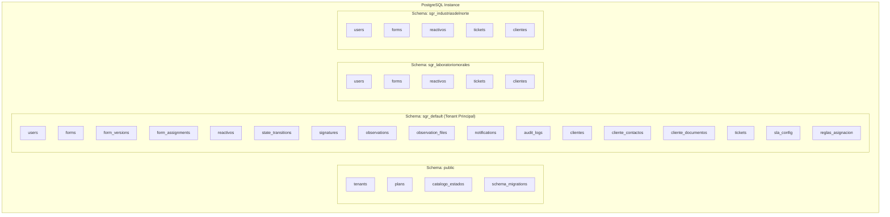
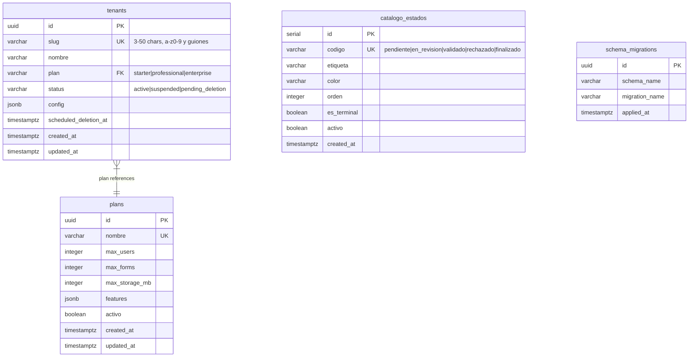
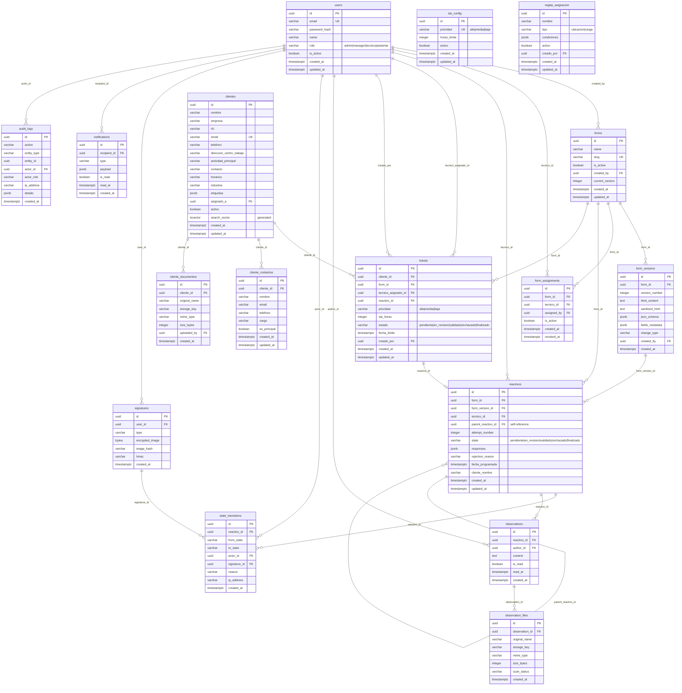

# DER — Base de Datos Multi-Tenant (Schema per Tenant)

## Estructura General

---

## Schema: public (Tablas de Plataforma)

---

## Schema: sgr_{slug} (Tablas por Tenant — 17 tablas idénticas)

---

## Resumen de Tablas

| Schema | Tabla | Cantidad |
|---|---|---|
| **public** | tenants, plans, catalogo_estados, schema_migrations | 4 |
| **sgr_{slug}** (por tenant) | users, forms, form_versions, form_assignments, reactivos, state_transitions, signatures, observations, observation_files, notifications, audit_logs, clientes, cliente_contactos, cliente_documentos, tickets, sla_config, reglas_asignacion | 17 |

**Total por tenant:** 17 tablas aisladas
**Total global:** 4 tablas compartidas + (17 × N tenants)
