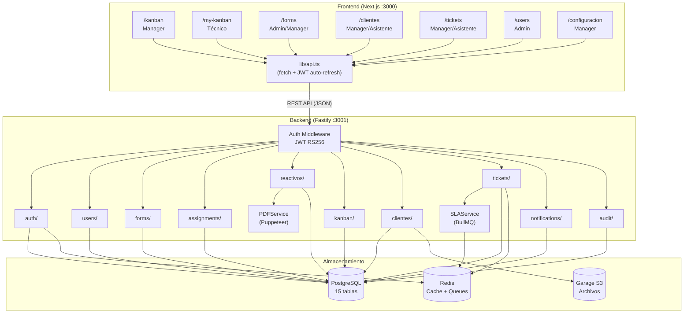
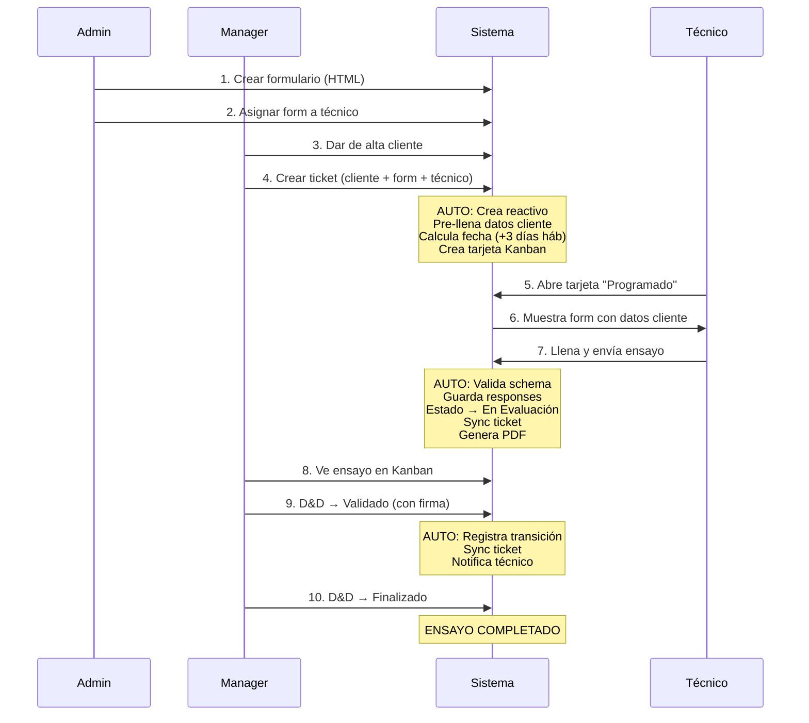
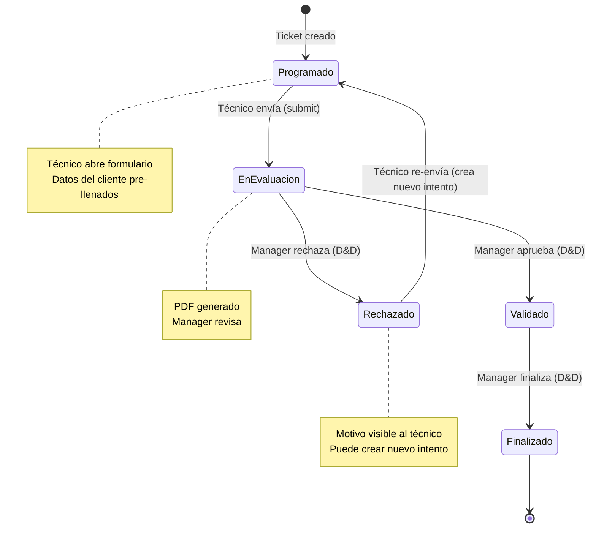
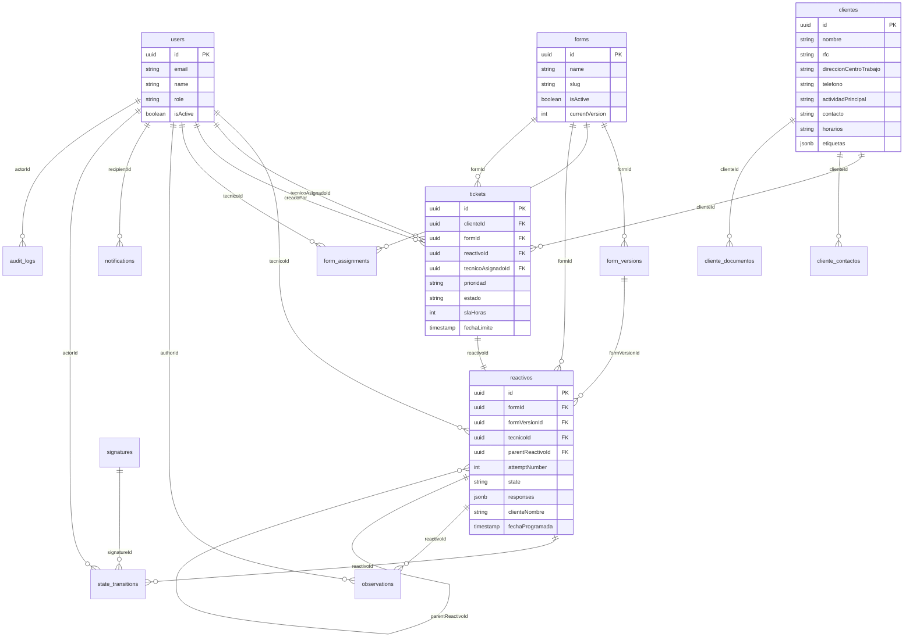
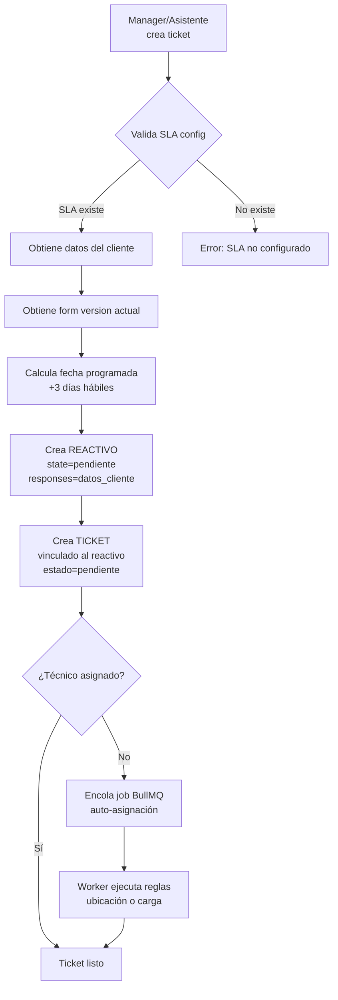
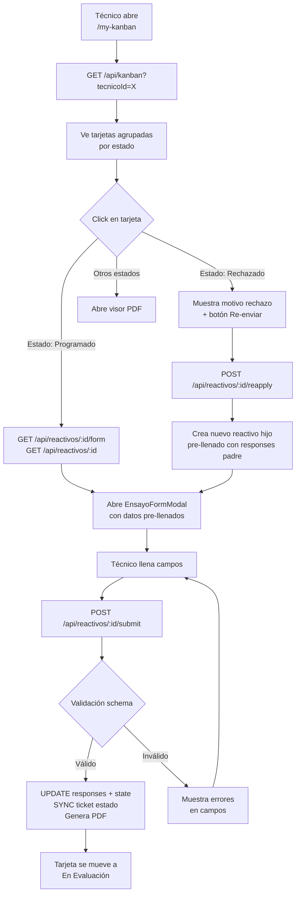
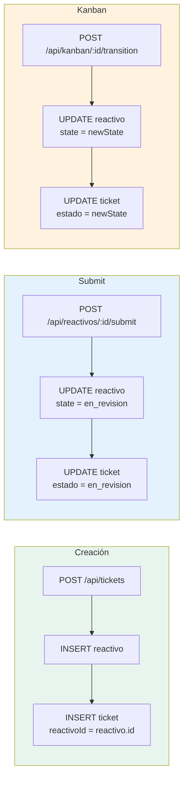
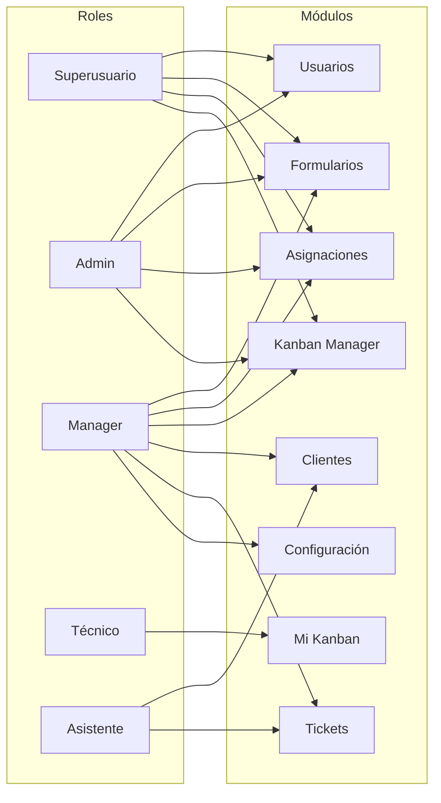

# Diagramas del Sistema SGR (Mermaid)

## 1. Arquitectura General

---

## 2. Ciclo de Vida del Ensayo

---

## 3. Máquina de Estados

---

## 4. Relaciones entre Tablas (ERD)

---

## 5. Flujo de Creación de Ticket

---

## 6. Flujo del Técnico (Submit)

---

## 7. Sincronización Ticket ↔ Reactivo

---

## 8. Permisos por Módulo

