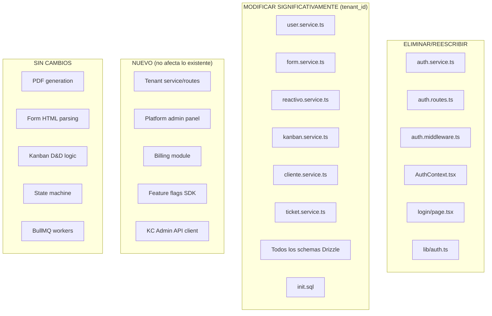

# Evaluación de Impacto: Propuesta Multi-Tenant con Keycloak v2.0

## Contexto Actual del SGR

El sistema actual es **single-tenant** con:
- Auth custom: JWT RS256 generado internamente (jose library)
- 5 roles fijos en código: superusuario, admin, manager, tecnico, asistente
- Una sola base de datos sin tenant_id
- Sin feature flags ni planes
- Sin billing
- Sin SSO/SAML
- ~15 tablas PostgreSQL, Redis para cache/queues, Garage S3 para archivos

---

## Impactos por Épica en Nuestro Código Actual

### ÉPICA 0: Fundación (Bajo impacto)

| Cambio | Archivos afectados | Esfuerzo |
|---|---|---|
| Crear tabla `tenants` | `init.sql`, nuevo schema Drizzle | Bajo |
| TenantContext middleware | Nuevo archivo, modificar `auth.middleware.ts` | Medio |
| Campo `kc_organization_id` | Solo en tabla tenants | Bajo |

**Impacto en SGR actual:** Mínimo. Se agrega middleware sin romper lo existente.

---

### ÉPICA KC: Integración Keycloak (Alto impacto arquitectónico)

| Cambio | Impacto en SGR |
|---|---|
| Keycloak como Auth provider | **ELIMINA** nuestro `auth.service.ts`, `auth.middleware.ts` custom |
| Protocol Mappers en JWT | **CAMBIA** la estructura del JWT (nuevos claims: tid, tsl, plan, roles[]) |
| Login flow | **ELIMINA** endpoint POST `/api/auth/login` — KC lo maneja |
| Refresh token | **ELIMINA** lógica de refresh — KC lo maneja |
| Logout + blacklist | **SIMPLIFICA** — KC revoca sesiones nativamente |

**Archivos que se eliminan o reescriben:**
```
packages/backend/src/modules/auth/auth.service.ts    → SE ELIMINA (KC reemplaza)
packages/backend/src/modules/auth/auth.routes.ts     → SE REDUCE (solo proxy a KC)
packages/backend/src/modules/auth/auth.middleware.ts  → SE REESCRIBE (valida JWT de KC)
packages/backend/src/modules/auth/auth.types.ts      → SE MODIFICA (nuevos claims)
packages/frontend/src/contexts/AuthContext.tsx        → SE REESCRIBE (OIDC flow)
packages/frontend/src/lib/auth.ts                    → SE REESCRIBE (KC tokens)
packages/frontend/src/app/login/page.tsx             → SE ELIMINA (KC login page)
```

**Lo que se gana:** SSO, MFA, SAML, brute-force protection, session management — todo gratis.

**Lo que se pierde:** Control total sobre el flujo de auth. Dependencia en servicio externo.

---

### ÉPICA 1: Capa de Datos Multi-Tenant (Alto impacto en código)

| Cambio | Archivos afectados | Esfuerzo |
|---|---|---|
| Agregar `tenant_id` a TODAS las tablas | `init.sql`, todos los schemas Drizzle (15 archivos) | Alto |
| RLS en PostgreSQL | `init.sql`, nuevo setup de policies | Alto |
| Todos los services deben filtrar por tenant | **TODOS** los `*.service.ts` (12+ servicios) | Alto |
| BaseRepository pattern | Nuevo patrón que envuelve Drizzle | Medio |

**Archivos afectados (TODOS los services):**
```
modules/users/user.service.ts          → +tenant_id filter
modules/forms/form.service.ts          → +tenant_id filter
modules/assignments/assignment.service.ts → +tenant_id filter
modules/reactivos/reactivo.service.ts  → +tenant_id filter
modules/kanban/kanban.service.ts       → +tenant_id filter
modules/clientes/cliente.service.ts    → +tenant_id filter
modules/tickets/ticket.service.ts      → +tenant_id filter
modules/notifications/notification.service.ts → +tenant_id filter
modules/observations/observation.service.ts → +tenant_id filter
modules/audit/audit.service.ts         → +tenant_id filter
modules/catalogs/catalog.routes.ts     → tenant-specific o global?
```

**Riesgo:** Si falta un `WHERE tenant_id = X` en una sola query, hay fuga de datos entre tenants.

---

### ÉPICA 2: Auth con Keycloak (Medio impacto)

| Cambio | Impacto |
|---|---|
| US-A01-KC: Login por subdominio | Frontend necesita OIDC library (oidc-client-ts), no más form login propio |
| US-A04-KC: JIT Provisioning | Nuevo middleware que crea user en DB al primer request |
| Roles de KC → roles SGR | Mapeo entre Organization Roles de KC y los 5 roles actuales |

**Problema de mapeo de roles:**
```
Roles actuales SGR:     superusuario, admin, manager, tecnico, asistente
Roles propuestos KC:    PLATFORM_ADMIN, TENANT_ADMIN, VIEWER, EDITOR, MANAGER

¿Cómo se mapean? Opciones:
- PLATFORM_ADMIN → superusuario (nivel plataforma, no tenant)
- TENANT_ADMIN   → admin (dentro de su tenant)
- MANAGER        → manager
- EDITOR         → tecnico (ejecuta ensayos)
- VIEWER         → asistente (solo lee)
```

**Decisión necesaria:** ¿Los roles SGR se eliminan y se usan los de KC, o se mantienen ambos?

---

### ÉPICA 3-6: Seguridad, Admin, Planes, Billing (Medio-Bajo impacto en código actual)

Estas épicas son **funcionalidad nueva** que no afecta el módulo de ensayos existente. Se construyen como módulos adicionales.

---

## Resumen de Impacto Global



---

## Análisis Costo-Beneficio

### Lo que GANAMOS con Keycloak

| Funcionalidad | Sin KC (desarrollo propio) | Con KC |
|---|---|---|
| MFA (TOTP + WebAuthn) | 3-4 semanas | Configuración 1 día |
| SSO / SAML | 4-6 semanas | Configuración 2-3 días |
| Brute-force protection | 1 semana | Incluido |
| Session management | 1 semana | Incluido |
| Email de invitación | 1 semana | Incluido |
| Account self-service | 2 semanas | Incluido (KC Account Console) |
| Multi-org por usuario | 3 semanas | Incluido (Organizations API) |
| **Total ahorro** | **~13-16 semanas** | — |

### Lo que CUESTA Keycloak

| Concepto | Costo |
|---|---|
| Curva de aprendizaje | 2-3 semanas (admin + protocol mappers) |
| Infraestructura adicional | 1 servidor/contenedor dedicado (~$20-40/mes) |
| Complejidad operacional | HA, backups, upgrades de KC |
| Dependencia externa | Si KC cae, nadie puede loguearse |
| Overhead en onboarding | Cada tenant necesita KC Organization + SGR DB |
| Testing más complejo | Tests de integración necesitan KC corriendo |

---

## Riesgos Principales

| Riesgo | Probabilidad | Impacto | Mitigación |
|---|---|---|---|
| KC Organizations API cambia en versión futura | Media | Alto | Pinear versión KC, tests de contrato |
| Fuga de datos inter-tenant por query sin filtro | Alta (en desarrollo) | Crítico | RLS como safety net + code review estricto |
| KC downtime = plataforma completa down | Baja (con HA) | Crítico | Cluster 2 nodos + fallback cache local de JWT |
| Complejidad de debug (KC + SGR + DB) | Alta | Medio | Logs estructurados con correlation IDs |
| Mapeo de roles KC ↔ SGR desincronizado | Media | Alto | Single source: KC roles como verdad, SGR lee del JWT |

---

## Recomendación

### Para tu situación actual (1 cliente, MVP en desarrollo):

**NO implementes todo esto ahora.** Es overkill.

### Orden recomendado de adopción:

| Fase | Cuándo | Qué |
|---|---|---|
| **Ahora** | MVP funcional | Mantén el auth actual. Enfócate en el módulo de ensayos. |
| **+2 meses** | 2-3 clientes reales | Agrega `tenant_id` (Épica 1). Sin KC aún. |
| **+6 meses** | 5+ clientes, piden SSO | Integra Keycloak (Épicas KC + 2). |
| **+12 meses** | 10+ clientes | Planes, billing, admin panel (Épicas 4-6). |

### Si decides ir con KC desde el inicio:

1. **Fase 0 + KC** juntas (semanas 1-5): Setup KC + tenant model
2. **Fase 1** (semanas 3-6): `tenant_id` + RLS — esto es lo más crítico
3. El resto puede esperar

### Alternativa más ligera a Keycloak:

Si KC es demasiado pesado para tu etapa actual, considera:
- **Clerk.dev** — Auth as a service, multi-tenant nativo, $25/mes
- **Auth.js (NextAuth)** — Self-hosted, más simple que KC, sin Organizations
- **Supabase Auth** — Si ya usas Supabase para DB

---

## Modificaciones Mínimas al SGR Actual para Preparar Multi-Tenancy

Sin implementar KC ni toda la propuesta, puedes **preparar el terreno** con cambios mínimos:

1. **Crear tabla `tenants`** con un registro "default"
2. **Agregar `tenant_id`** a todas las tablas (nullable, default al tenant "default")
3. **Crear un `TenantContext` middleware** que por ahora siempre retorna el tenant "default"
4. **Agregar `tenant_id` a los queries** gradualmente (sin romper nada)

Esto te da: código listo para multi-tenant sin complejidad operacional adicional. Cuando llegue el momento de KC o de múltiples clientes, solo activas el filtro real.
